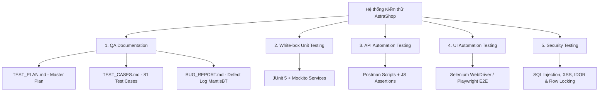
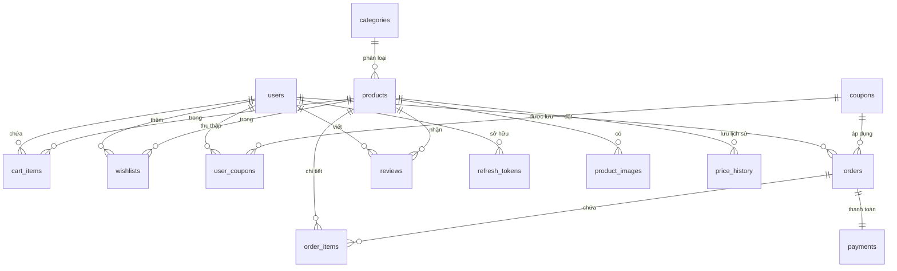
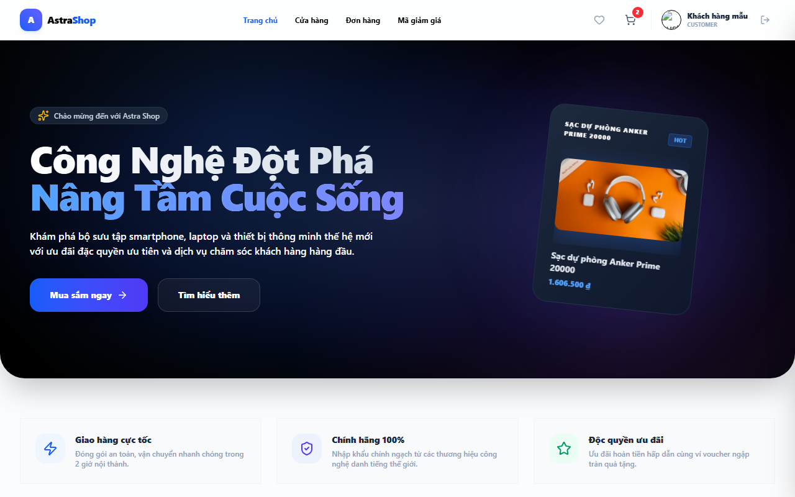
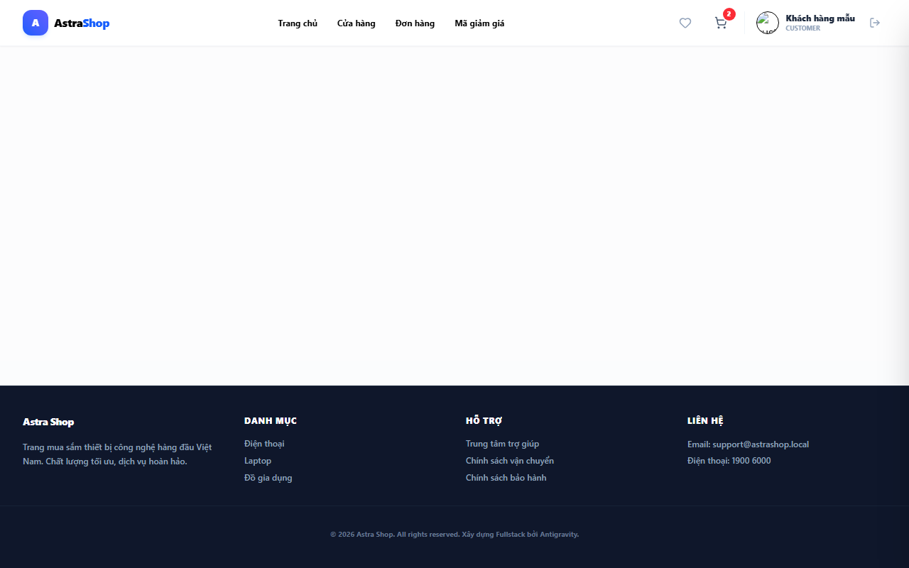
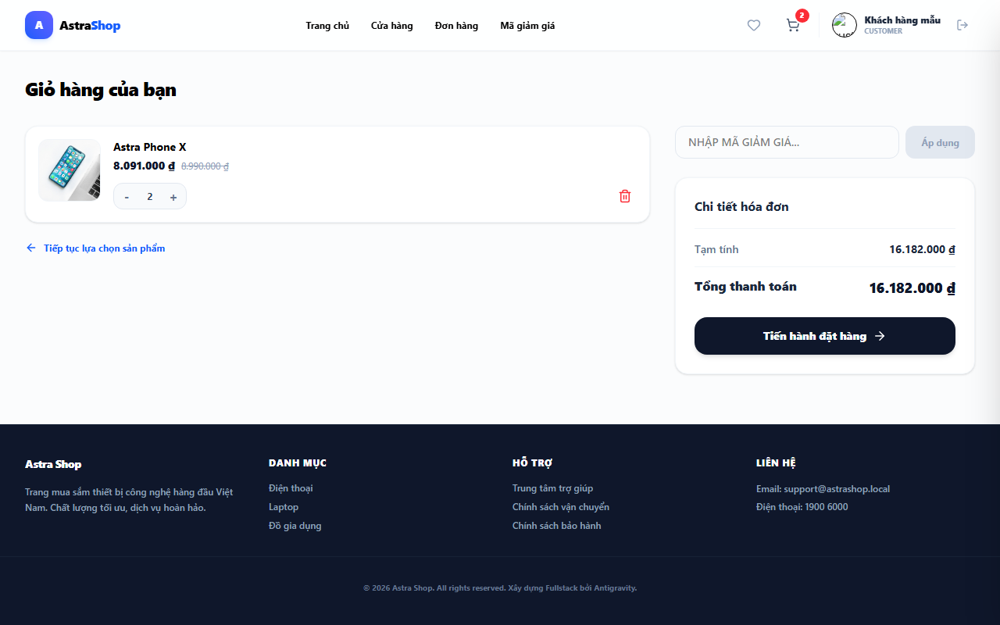
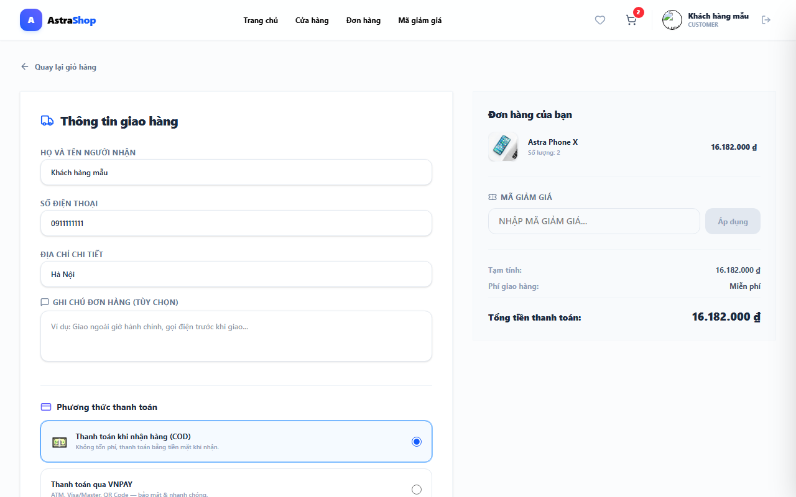
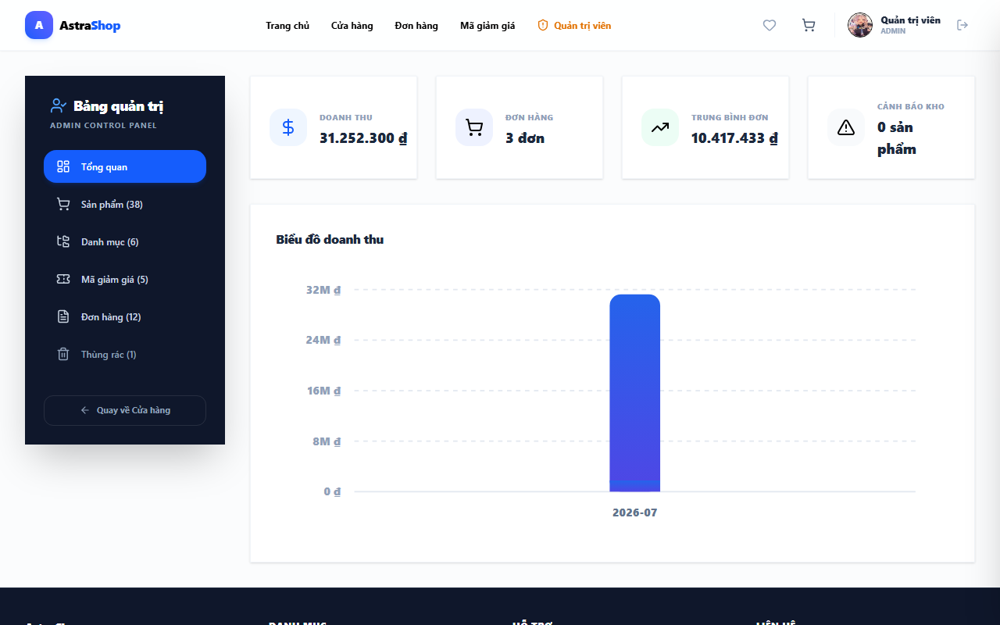

# 🛒 Mini E-Commerce System (Hệ thống Thương mại Điện tử Mini - AstraShop)

Dự án **Mini E-Commerce System** là một hệ thống bán hàng trực tuyến toàn diện, được xây dựng với kiến trúc **Monolithic** tinh gọn, hiện đại và chuẩn hóa. 

- **Backend**: Sử dụng **Java 21** và **Spring Boot 4.0.6**, tận dụng sức mạnh của **Spring Data JPA & Hibernate** để quản lý cơ sở dữ liệu **MySQL** một cách an toàn, nhất quán thông qua các cơ chế di chuyển lược đồ tự động với **Flyway**.
- **Frontend**: Được phát triển bằng **React 19 + TypeScript**, sử dụng **Vite** làm công cụ đóng gói siêu tốc, quản lý trạng thái giỏ hàng bằng **Zustand**, gọi API với **Axios**, và xây dựng giao diện đẹp mắt bằng **TailwindCSS (v4)**.

---

## 🧪 Phân Hệ Kiểm Thử Toàn Diện & Quản Lý Chất Lượng (QA & Testing Portfolio)

Dự án được tích hợp bộ **Suite Kiểm Thử Toàn Diện (Fullstack QA & Automation Suite)** chuyên nghiệp dành riêng cho **Hồ sơ xin việc Tester / QA / QC / Fullstack**, bao gồm tài liệu quy chuẩn và mã nguồn test tự động ở mọi cấp độ:



### 📄 1. Bộ Tài Liệu Quy Chuẩn Kiểm Thử (QA Documentation)
* **Master Test Plan:** [TEST_PLAN.md](TEST_PLAN.md) - Kế hoạch kiểm thử tổng thể quy định phạm vi, môi trường, tiêu chí Pass/Fail và chiến lược Black-box/White-box/Gray-box.
* **Ma trận 81 Test Cases Chi Tiết:** [TEST_CASES.md](TEST_CASES.md) - Thiết kế ma trận 81 kịch bản kiểm thử áp dụng kỹ thuật Phân vùng tương đương (Equivalence Partitioning), Phân tích giá trị biên (Boundary Value Analysis).
* **Nhật ký Báo cáo & Theo dõi Lỗi:** [BUG_REPORT.md](BUG_REPORT.md) - Mô phỏng quy trình ghi nhận và quản lý lỗi chuẩn MantisBT / Jira Defect Log.

---

### 🔍 2. Chi Tiết Nội Dung Dự Án Kiểm Thử (What The Project Tests)

Hệ thống được kiểm thử tự động và thủ công phủ kín các mảng tính năng:

#### A. Kiểm thử Nghiệp vụ & Chức năng (Functional & Business Logic Testing)
* **Xác thực & Người dùng:** Đăng ký, Đăng nhập (JWT Access & Refresh Token), mã hóa mật khẩu BCrypt, validation form client/server, tài khoản bị khóa (`BANNED`), quên mật khẩu qua OTP 6 số, đăng nhập nhanh qua Google OAuth2.
* **Sản phẩm & Danh mục:** Tìm kiếm nâng cao, lọc đa danh mục (Multi-select), lọc khoảng giá (Price Slider boundary), phân trang backend & frontend (`page`, `size`, `sortBy`), album ảnh gallery.
* **Yêu thích (Wishlist):** Thêm/xóa wishlist, tự động nhận cảnh báo giảm giá cho các sản phẩm trong wishlist (nếu giảm giá trong 7 ngày).
* **Giỏ hàng & Voucher:** Tính tổng tiền chiết khấu, áp mã coupon (% giảm, lượt dùng tối đa `max_uses`, hạn sử dụng), ví voucher cá nhân `/vouchers`, đồng bộ giỏ hàng thời gian thực giữa các Tab trình duyệt (Storage Event), chống spam click +/- nút số lượng.
* **Thanh toán & Tranh chấp Tồn kho:** Đặt hàng COD & cổng **VNPAY Sandbox**, kiểm thử **Database Row Locking (`SELECT ... FOR UPDATE`)** chống lỗi tranh chấp hàng tồn kho (Race condition) khi 2 khách hàng cùng checkout sản phẩm cuối cùng.
* **Đánh giá (Review):** Ràng buộc logic chỉ cho phép khách hàng đã mua sản phẩm & đơn hàng giao thành công (`DELIVERED`) được gửi đánh giá 1-5 sao.
* **Quản trị viên (Admin) & Thùng rác:** Admin Dashboard thống kê doanh thu, CRUD sản phẩm & upload ảnh, đổi danh mục hàng loạt, cập nhật trạng thái đơn hàng (tự động cộng hoàn kho khi hủy đơn `CANCELLED`), Thùng rác hệ thống (Recycle Bin - Soft delete & Restore data).

#### B. Kiểm thử Đơn vị Backend - Hộp trắng (White-box Unit Tests)
* **Công cụ:** JUnit 5, Mockito (`@Mock`, `@InjectMocks`, `when().thenReturn()`).
* **Mã nguồn test:**
  * [AuthServiceTest.java](src/test/java/com/example/Webbanhang/service/AuthServiceTest.java): Test độc lập logic đăng ký, đăng nhập, mã hóa mật khẩu, tài khoản bị khóa, sinh JWT token.
  * [ShopServiceTest.java](src/test/java/com/example/Webbanhang/service/ShopServiceTest.java): Test độc lập logic tính tổng tiền giỏ hàng, áp mã giảm giá, kiểm tra vượt tồn kho.
  * [ApiControllerTests.java](src/test/java/com/example/Webbanhang/controller/ApiControllerTests.java): Test tích hợp 13 API endpoints bằng MockMvc.
* **Kết quả:** **21/21 Unit & Integration Tests PASSED (100% Pass Rate)**, `BUILD SUCCESS`.

#### C. Kiểm thử API Tự Động (API Automation Testing)
* **Công cụ:** Postman Automation Test Collection ([AstraShop.postman_collection.json](AstraShop.postman_collection.json)).
* **Đặc điểm kỹ thuật:** Gắn sẵn các đoạn mã JavaScript `pm.test()` tự động kiểm tra HTTP Status Code (200 OK, 400 Bad Request, 401 Unauthorized, 403 Forbidden), Validate JSON Schema, và trích xuất JWT Token tự động lưu vào Environment Variable cho các request tiếp theo.

#### D. Kiểm thử Giao diện Tự Động (UI Automation E2E Testing)
* **Công cụ:** Selenium WebDriver API / Playwright ([selenium_test.js](selenium_test.js)).
* **Kịch bản tự động hóa:**
  1. `TC_UI_001`: Đăng nhập Khách hàng thành công.
  2. `TC_UI_002`: Xem trang Chi tiết sản phẩm & Album gallery.
  3. `TC_UI_003`: Thêm giỏ hàng, Áp Voucher & Trang Thanh toán (Checkout).
  4. `TC_UI_004`: Đăng nhập Admin, Xem Dashboard thống kê & Báo cáo.

#### E. Kiểm thử An toàn & Bảo mật (Security Testing)
* **Chống SQL Injection:** Kiểm thử câu lệnh độc hại `' OR '1'='1`, `UNION SELECT` tại ô Tìm kiếm và Form Đăng nhập.
* **Chống Cross-Site Scripting (XSS):** Kiểm thử chèn mã script `<script>alert('xss')</script>` tại ô Đánh giá bình luận.
* **Chống Lỗ hổng IDOR:** Kiểm thử dùng Bearer Token của tài khoản A để truy cập đơn hàng của tài khoản B.
* **Chống Double Submit:** Kiểm thử gửi 2 request checkout cùng thời điểm < 100ms.
* **Bảo mật Secret Keys:** Quản lý toàn bộ Database Password, JWT Secret Key, Google Client ID, VNPAY Hash Secret bằng **Biến môi trường (Environment Variables)** theo chuẩn OWASP / SAIF.

---

## 📝 Tài Liệu & Báo Cáo Môn Học

* **Tài liệu Backend:** Xem chi tiết tại **[bao_cao_backend.md](bao_cao_backend.md)**. Tài liệu gồm mô tả nhóm API, lược đồ CSDL 3NF (ERD) và hướng dẫn chạy.
* **Tài liệu Frontend:** Xem chi tiết tại **[bao_cao_frontend.md](bao_cao_frontend.md)**. Tài liệu gồm thiết kế kiến trúc React + TS, quản lý trạng thái Zustand, thiết kế các component yêu cầu và tích hợp API.
* **Tài liệu Swagger / OpenAPI:** Tích hợp trực tiếp qua thư viện `springdoc-openapi`.
    * **Swagger UI:** `http://localhost:8080/swagger-ui/index.html` (khi server đang chạy).
    * **OpenAPI JSON Spec:** `http://localhost:8080/v3/api-docs`.

---

## 🚀 Điểm Nổi Bật Về Kỹ Thuật (Technical Highlights)

* **Spring Data JPA & Hibernate**: Sử dụng JPA Repository để thao tác dữ liệu an toàn, khai báo quan hệ rõ ràng giữa các thực thể và tối ưu cơ chế nạp dữ liệu (Lazy/Eager loading).
* **Database Row Locking (`SELECT ... FOR UPDATE`)**: Khi khách hàng tiến hành thanh toán (Checkout), hệ thống sẽ khóa các dòng sản phẩm tương ứng trong database để tránh tình trạng tranh chấp hàng tồn kho (race condition) khi nhiều luồng thanh toán cùng một sản phẩm cùng lúc.
* **Realtime Communication (Spring WebSocket)**: Sử dụng WebSocket (`SimpMessagingTemplate`) để phát sóng thời gian thực (Broadcast) các sự kiện thay đổi tồn kho, tạo đơn hàng mới, cập nhật sản phẩm/danh mục tới tất cả khách hàng đang kết nối.
* **Lịch sử biến động giá & Thông báo giảm giá**: Hệ thống tự động ghi lại lịch sử thay đổi giá gốc/giá khuyến mãi của sản phẩm. Khi sản phẩm trong Wishlist của người dùng được giảm giá (trong vòng 7 ngày gần nhất), hệ thống sẽ gửi thông báo giảm giá trực quan.
* **Thùng rác hệ thống (Recycle Bin)**: Hỗ trợ xóa mềm (Soft Delete) đối với Sản phẩm, Danh mục, Người dùng, và Mã giảm giá. Dữ liệu bị xóa sẽ được nén dưới dạng JSON lưu vào bảng `recycle_bin` và có khả năng khôi phục (Restore) nguyên trạng hoàn toàn.

---

## 🗄️ Thiết Kế Cơ Sở Dữ Liệu (Database Schema)



---

## ⚙️ Hướng Dẫn Cài Đặt & Vận Hành (Setup & Configuration)

### 🔑 Biến Môi Trường Bảo Mật (Environment Variables)
Truyền cấu hình bảo mật thông qua biến môi trường để chống rò rỉ secret lên Git repository:

```bash
export DB_URL="jdbc:mysql://localhost:3306/webbanhang"
export DB_USERNAME="root"
export DB_PASSWORD="your_secure_db_password"
export JWT_SECRET="your_custom_jwt_secret_key_at_least_32_bytes"
export VNPAY_HASH_SECRET="your_vnpay_hash_secret"
```

### 🛠️ Các bước khởi động
1. **Khởi chạy MySQL Database:** Tạo database `webbanhang` với charset `utf8mb4`.
2. **Khởi chạy Backend (Spring Boot):**
   ```powershell
   .\mvnw.cmd spring-boot:run
   ```
3. **Khởi chạy Frontend (React + Vite):**
   ```bash
   cd frontend
   npm install
   npm run dev
   ```

---

## 🔑 Tài Khoản Thử Nghiệm Mẫu (Sample Testing Accounts)

> [!NOTE]
> Để đảm bảo an toàn dữ liệu, các mật khẩu dưới đây áp dụng cho môi trường kiểm thử Local Development. Trên môi trường thực tế, mật khẩu được băm mã hóa bằng BCrypt và hỗ trợ ghi đè bằng biến môi trường.

| Vai trò (Role) | Tên đăng nhập (Username) | Mật khẩu mẫu (Password) | Phân quyền & Mục đích kiểm thử |
| :--- | :--- | :--- | :--- |
| **Quản trị viên** | `admin` | `admin123` | Quyền Quản trị viên hệ thống (Admin Dashboard, CRUD Sản phẩm, Quản lý Đơn hàng, Thùng rác). |
| **Khách hàng mẫu** | `customer` | `customer123` | Quyền Khách hàng (Duyệt hàng, Giỏ hàng, Sưu tầm Voucher, Thanh toán VNPAY/COD, Đánh giá sản phẩm). |

---

## 📸 Hình ảnh các kịch bản kiểm thử tự động (Automation Execution Screenshots)

Hình ảnh kết quả thực thi tự động từ **Selenium WebDriver Test Suite**:

#### 1. Automation Test 1 - Đăng nhập Khách hàng thành công:


#### 2. Automation Test 2 - Trang Chi tiết sản phẩm:


#### 3. Automation Test 3 - Trang Giỏ hàng & Áp Coupon:


#### 4. Automation Test 3 (tiếp) - Màn hình Trang Thanh toán (Checkout):


#### 5. Automation Test 4 - Admin Dashboard & Thống kê doanh thu:

