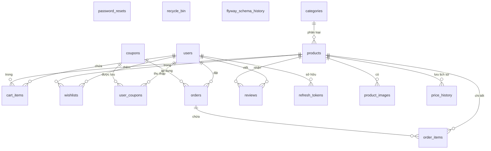

# 🛒 Mini E-Commerce System (Hệ thống Thương mại Điện tử Mini - AstraShop)

Dự án **Mini E-Commerce System** là một hệ thống bán hàng trực tuyến toàn diện, được xây dựng với kiến trúc **Monolithic** tinh gọn, hiện đại và chuẩn hóa. 

- **Backend**: Sử dụng **Java 21** và **Spring Boot 4.0.6**, tận dụng sức mạnh của **Spring Data JPA & Hibernate** để quản lý cơ sở dữ liệu **MySQL** một cách an toàn, nhất quán thông qua các cơ chế di chuyển lược đồ tự động với **Flyway**.
- **Frontend**: Được phát triển bằng **React 18/19 + TypeScript**, sử dụng **Vite** làm công cụ đóng gói siêu tốc, quản lý trạng thái giỏ hàng bằng **Zustand**, gọi API với **Axios**, và xây dựng giao diện đẹp mắt bằng **TailwindCSS (v4)**.

Hệ thống được tích hợp các cơ chế bảo mật cao cấp (JWT, Google OAuth2), các tính năng nâng cao như **Nhận thông báo giảm giá từ Wishlist**, **Thùng rác khôi phục dữ liệu (Recycle Bin)**, **Khóa dòng dữ liệu chống tranh chấp hàng tồn kho (Database Row Locking)**, và **Cập nhật thời gian thực (Realtime WebSockets)**.

---

## 📝 Tài Liệu & Báo Cáo Học Tập

Để phục vụ yêu cầu kiểm thử và nộp báo cáo cho môn học, dự án đã chuẩn bị sẵn đầy đủ các tài liệu minh chứng:
*   **Tài liệu Backend:** Xem chi tiết tại **[bao_cao_backend.md](bao_cao_backend.md)**. Tài liệu gồm mô tả nhóm API, lược đồ CSDL 3NF (ERD) và hướng dẫn chạy.
*   **Tài liệu Frontend:** Xem chi tiết tại **[bao_cao_frontend.md](bao_cao_frontend.md)**. Tài liệu gồm thiết kế kiến trúc React + TS, quản lý trạng thái Zustand, thiết kế các component yêu cầu và tích hợp API.
*   **Kịch bản Thuyết trình bảo vệ:** Xem chi tiết tại **[KICH_BAN_THUYET_TRINH.md](KICH_BAN_THUYET_TRINH.md)** chuẩn bị sẵn các lời dẫn thuyết trình trước giáo viên.
*   **Bộ Test API 13 Trường Hợp Toàn Diện (Vượt mức 8 yêu cầu tối thiểu):** 
    *   **Test tự động hóa (JUnit & MockMvc):** Mã nguồn nằm tại [ApiControllerTests.java](src/test/java/com/example/webbanhang/controller/ApiControllerTests.java).
    *   **Test thủ công bằng REST Client:** File [api-test-cases.http](api-test-cases.http) ở thư mục gốc chứa sẵn 13 kịch bản kiểm thử (8 thành công, 5 thất bại).
*   **Tài liệu Swagger / OpenAPI:** Tích hợp trực tiếp qua thư viện `springdoc-openapi`.
    *   **Swagger UI (Web trực quan):** `http://localhost:8080/swagger-ui/index.html` (khi server đang chạy).
    *   **OpenAPI JSON Specification:** `http://localhost:8080/v3/api-docs`.

---

## 🚀 Điểm Nổi Bật Về Kỹ Thuật (Technical Highlights)

*   **Spring Data JPA & Hibernate**: Sử dụng JPA Repository để thao tác dữ liệu an toàn, khai báo quan hệ rõ ràng giữa các thực thể và tối ưu cơ chế nạp dữ liệu (Lazy/Eager loading).
*   **Database Row Locking (`SELECT ... FOR UPDATE`)**: Khi khách hàng tiến hành thanh toán (Checkout), hệ thống sẽ khóa các dòng sản phẩm tương ứng trong database để tránh tình trạng tranh chấp hàng tồn kho (race condition) khi nhiều luồng thanh toán cùng một sản phẩm cùng lúc.
*   **Realtime Communication (Spring WebSocket)**: Sử dụng WebSocket (`SimpMessagingTemplate`) để phát sóng thời gian thực (Broadcast) các sự kiện thay đổi tồn kho, tạo đơn hàng mới, cập nhật sản phẩm/danh mục tới tất cả khách hàng đang kết nối.
*   **Lịch sử biến động giá & Thông báo giảm giá**: Hệ thống tự động ghi lại lịch sử thay đổi giá gốc/giá khuyến mãi của sản phẩm. Khi sản phẩm trong Wishlist của người dùng được giảm giá (trong vòng 7 ngày gần nhất), hệ thống sẽ gửi thông báo giảm giá trực quan.
*   **Thùng rác hệ thống (Recycle Bin)**: Hỗ trợ xóa mềm (Soft Delete) đối với Sản phẩm, Danh mục, Người dùng, và Mã giảm giá. Dữ liệu bị xóa sẽ được nén dưới dạng JSON lưu vào bảng `recycle_bin` và có khả năng khôi phục (Restore) nguyên trạng hoàn toàn.
*   **Google One Tap Login**: Hợp nhất đăng nhập bằng Google OAuth2 một cách mượt mà ở phía Client và xác thực bảo mật ở phía Server thông qua Google API Token Info.

---

## 🌟 Danh Sách Tính Năng Chi Tiết (Feature List)

### 👤 Người dùng (Customer / Guest)
*   **Đăng ký & Đăng nhập**: Xác thực JWT token, mã hóa mật khẩu PBKDF2/BCrypt, kiểm tra độ phức tạp của mật khẩu và tính hợp lệ của số điện thoại. Tích hợp đăng nhập nhanh qua Google.
*   **Quản lý tài khoản**: Thay đổi mật khẩu, cập nhật thông tin cá nhân (Họ tên, SĐT, Địa chỉ, Avatar tự động qua Dicebear API).
*   **Quên mật khẩu & OTP**: Gửi mã OTP xác nhận đặt lại mật khẩu với thời gian hết hạn là 1 phút (OTP in ra Console hệ thống để test tiện lợi).
*   **Khám phá sản phẩm**: Tìm kiếm nâng cao, lọc theo Danh mục, mức giá (Min-Max Price), điểm đánh giá trung bình. Sắp xếp theo giá tăng/giảm dần, điểm đánh giá hoặc mới nhất.
*   **Yêu thích & Wishlist (Mới cập nhật)**: Thêm/xóa sản phẩm yêu thích hoạt động chính xác. Khách hàng có thể truy cập trang danh mục yêu thích và nhận thông báo giảm giá tự động nếu sản phẩm được giảm giá trong vòng 7 ngày qua.
*   **Giỏ hàng & Ví Voucher (Mới cập nhật)**:
    *   Thêm, bớt, cập nhật số lượng trực tiếp trong giỏ hàng.
    *   **Trang sưu tầm mã giảm giá:** Người dùng có thể vào trang `/vouchers` để thu thập các mã giảm giá đang hoạt động.
    *   **Quản lý mã giảm giá cá nhân:** Hiển thị danh sách các mã đang sở hữu, phân rõ mã có thể sử dụng và mã đã hết hạn/đã dùng.
    *   **Tự động áp dụng:** Khi nhấn nút "Dùng ngay" tại trang voucher, hệ thống sẽ tự động chuyển hướng và áp mã giảm giá đó vào giỏ hàng.
    *   **Chọn nhanh mã giảm giá:** Tại trang thanh toán, khi nhấn vào ô nhập mã giảm giá, một danh sách các mã giảm giá khả dụng của người dùng sẽ hiện lên để click chọn trực quan mà không cần gõ thủ công.
*   **Thanh toán & Đơn hàng**:
    *   Đặt hàng, chọn địa chỉ và ghi chú. Trừ tồn kho an toàn bằng Row Locking.
    *   Theo dõi trạng thái đơn hàng: `PENDING` (Chờ xác nhận) $\rightarrow$ `CONFIRMED` (Đã xác nhận) $\rightarrow$ `SHIPPING` (Đang giao) $\rightarrow$ `DELIVERED` (Đã giao) $\rightarrow$ `CANCELLED` (Đã hủy).
    *   Khách hàng có thể tự hủy đơn hàng khi đơn hàng đang ở trạng thái `PENDING`, tồn kho sẽ được hoàn lại tự động.
*   **Đánh giá sản phẩm (Mới cập nhật)**:
    *   **Logic chặt chẽ:** Chỉ những khách hàng đã mua và có đơn hàng được giao thành công (`DELIVERED`) đối với sản phẩm đó mới được viết đánh giá (1-5 sao) và bình luận.
    *   **Dữ liệu mẫu sinh động:** Đã seed sẵn các đánh giá và bình luận mẫu vào cơ sở dữ liệu để trang sản phẩm hiển thị đầy đủ và trực quan.

### 👑 Quản trị viên (Admin)
*   **Dashboard Thống kê**:
    *   Thống kê doanh thu, số lượng đơn hàng, sản phẩm và khách hàng theo thời gian (Hôm nay, Tuần này, Tháng này, Năm này).
    *   Biểu đồ doanh thu trực quan, cơ cấu doanh thu theo Danh mục sản phẩm, và danh sách các sản phẩm bán chạy nhất.
    *   Cảnh báo sản phẩm sắp hết hàng (Tồn kho dưới 10).
*   **Quản lý danh mục & sản phẩm**:
    *   CRUD Danh mục & Sản phẩm, cập nhật ảnh sản phẩm qua upload file tĩnh.
    *   Chuyển đổi danh mục hàng loạt cho nhiều sản phẩm cùng lúc (Bulk update category).
    *   Xem lịch sử thay đổi giá của từng sản phẩm.
    *   Ràng buộc bảo mật dữ liệu: Không cho phép xóa cứng sản phẩm đã từng phát sinh đơn hàng (ngăn ngừa lỗi toàn vẹn tham chiếu).
*   **Quản lý Voucher & Đơn hàng (Mới cập nhật)**:
    *   Tạo mã coupon với hạn sử dụng, phần trăm giảm giá và giới hạn số lượt phát hành tối đa (`max_uses`).
    *   **Điều chỉnh thời hạn hết hạn:** Tại màn hình quản lý voucher của Admin, hỗ trợ tùy chỉnh ngày bắt đầu và ngày hết hạn một cách trực quan.
    *   Cập nhật trạng thái đơn hàng. Nếu chuyển sang trạng thái `CANCELLED`, tồn kho sản phẩm sẽ được tự động cộng trả lại.
*   **Quản lý tài khoản & Thùng rác**:
    *   Khóa tài khoản khách hàng (`BANNED`) có thời hạn hoặc vĩnh viễn. Không cho phép xóa khách hàng đã có lịch sử đơn hàng để bảo vệ dữ liệu báo cáo tài chính.
    *   Thùng rác hệ thống: Khôi phục nhanh hoặc xóa vĩnh viễn các thực thể đã xóa mềm (User, Product, Category, Coupon).

---

## 🗄️ Thiết Kế Cơ Sở Dữ Liệu (Database Schema)

Cơ sở dữ liệu MySQL của hệ thống được thiết kế chuẩn hóa và liên kết chặt chẽ để hỗ trợ các chức năng mua sắm, quản lý giỏ hàng, thanh toán và quản trị nâng cao.

### 1. Sơ đồ mối quan hệ thực thể (Entity Relationship Diagram - ERD)



### 2. Mô tả chi tiết chức năng của các bảng dữ liệu

Hệ thống bao gồm **16 bảng** được chia thành các nhóm chức năng chính như sau:

| STT | Tên Bảng | Ý Nghĩa / Chức Năng |
| :--- | :--- | :--- |
| 1 | **`users`** | Lưu trữ thông tin tài khoản người dùng (Khách hàng & Quản trị viên), vai trò (`CUSTOMER`/`ADMIN`), trạng thái (`ACTIVE`/`BANNED`), thông tin cá nhân và mật khẩu băm BCrypt. |
| 2 | **`categories`** | Danh mục sản phẩm (ví dụ: Điện thoại, Laptop, Phụ kiện...), hỗ trợ phân loại và lọc tìm kiếm trên giao diện. |
| 3 | **`products`** | Thông tin chi tiết sản phẩm: tên, giá bán, số lượng tồn kho, thương hiệu, mức giảm giá và liên kết khóa ngoại tới bảng danh mục. |
| 4 | **`product_images`** | Bộ sưu tập ảnh phụ (gallery) của sản phẩm, giúp hiển thị nhiều góc chụp khác nhau của sản phẩm. |
| 5 | **`price_history`** | Lịch sử thay đổi giá bán/phần trăm giảm giá của sản phẩm, hỗ trợ phân tích xu hướng giá và thông báo giảm giá cho khách hàng. |
| 6 | **`cart_items`** | Giỏ hàng tạm thời của khách hàng, lưu trữ danh sách sản phẩm và số lượng tương ứng trước khi tiến hành thanh toán. |
| 7 | **`wishlists`** | Danh sách sản phẩm yêu thích được lưu bởi khách hàng để theo dõi tiện lợi. |
| 8 | **`coupons`** | Thông tin các mã giảm giá (voucher) do hệ thống hoặc Admin phát hành (mã code, hạn dùng, số lượt sử dụng tối đa). |
| 9 | **`user_coupons`** | Ví voucher cá nhân, lưu giữ các mã giảm giá khách hàng đã thu thập được để sử dụng lúc thanh toán. |
| 10 | **`orders`** | Đơn hàng tổng quát: thông tin người nhận, địa chỉ giao hàng, tổng tiền, tiền giảm giá, trạng thái đơn hàng (`PENDING`, `DELIVERED`, `CANCELLED`...), phương thức thanh toán (`COD`/`VNPAY`), trạng thái thanh toán (`PENDING`/`PAID`/`FAILED`) và thông tin đối chiếu VNPAY (`vnpay_txn_ref`, `vnpay_transaction_no`). |
| 11 | **`order_items`** | Chi tiết từng sản phẩm trong đơn hàng (giá bán và số lượng tại thời điểm mua), đảm bảo tính toàn vẹn của hóa đơn khi giá sản phẩm thay đổi sau này. |
| 12 | **`reviews`** | Đánh giá và bình luận về sản phẩm (đánh giá sao từ 1 đến 5), ràng buộc logic chỉ cho phép khách hàng đánh giá sau khi đã mua sản phẩm đó. |
| 13 | **`recycle_bin`** | Thùng rác hệ thống lưu trữ các dữ liệu đã xóa mềm (Soft Delete) dưới dạng chuỗi JSON, cho phép Admin khôi phục nhanh (User, Product, Category, Coupon). |
| 14 | **`refresh_tokens`** | Quản lý các Token gia hạn hỗ trợ hệ thống tự động làm mới JWT Access Token ngắn hạn mà người dùng không cần đăng nhập lại. |
| 15 | **`password_resets`** | Lưu trữ mã xác thực OTP dùng một lần và thời hạn hiệu lực để phục vụ tính năng "Quên mật khẩu". |
| 16 | **`flyway_schema_history`** | Bảng hệ thống tự động được tạo bởi thư viện Flyway để ghi nhận lịch sử nâng cấp/di chuyển schema, đảm bảo tính đồng bộ cấu trúc DB giữa local và production. |


---

## 📂 Cấu Trúc Thư Mục Dự Án (Folder Structure)

```text
Webbanhang/
├── frontend/                 # --- DỰ ÁN FRONTEND (React 18 + TS) ---
│   ├── src/
│   │   ├── components/       # Các component dùng chung (CartDrawer, ProductCard, FilterSidebar...)
│   │   ├── pages/            # Các trang giao diện (Home, ProductList, ProductDetail, Checkout, Admin...)
│   │   ├── services/         # Axios config API kết nối đến Backend
│   │   ├── store/            # Quản lý State bằng Zustand (useCartStore, useAuthStore)
│   │   ├── types/            # Định nghĩa Interface TypeScript
│   │   └── App.tsx           # Router chính (React Router Dom v6)
│   ├── package.json          # Quản lý thư viện và script chạy
│   └── vite.config.ts        # Cấu hình Vite & Proxy kết nối API backend
├── src/                      # --- DỰ ÁN BACKEND (Spring Boot) ---
│   ├── main/
│   │   ├── java/com/example/webbanhang/
│   │   │   ├── common/       # Lớp tiện ích JSONHelper, ApiResponse chung
│   │   │   ├── config/       # Flyway, WebSocketConfig, WebMvcConfig
│   │   │   ├── controller/   # API Controllers (Auth, Catalog, Cart, Upload)
│   │   │   │   └── admin/    # AdminController quản lý dashboard, CRUD và Recycle Bin
│   │   │   ├── domain/       # Các Entity JPA (User, Product, Category, Order, CartItem...)
│   │   │   ├── dto/          # Data Transfer Objects (Requests & Responses)
│   │   │   ├── exception/    # Tầng bắt lỗi tập trung (GlobalExceptionHandler)
│   │   │   ├── repository/   # Spring Data JPA Repositories
│   │   │   ├── security/     # Cấu hình Spring Security, JWT Service, Auth Filters
│   │   │   └── service/      # Business Logic Services (AuthService, ShopService, CatalogService)
│   │   └── resources/
│   │       ├── db/migration/ # Các file SQL migrations của Flyway
│   │       ├── static/       # Chứa thư mục uploads ảnh và các file build tĩnh của React frontend
│   │       └── application.properties # Cấu hình ứng dụng (Port, Database URL, JWT Secret...)
```

---

## ⚙️ Hướng Dẫn Cài Đặt & Vận Hành (Setup & Running Guide)

### 📋 Yêu cầu hệ thống
*   **Java**: Phiên bản JDK 21 trở lên.
*   **Node.js**: Phiên bản 18 trở lên.
*   **Maven**: Bản 3.8+ (đã tích hợp sẵn Maven Wrapper trong dự án làm công cụ chạy tiện lợi).
*   **Database**: MySQL Server 8.0 trở lên.

### 🛠️ Các bước khởi động nhanh

#### Bước 1: Chuẩn bị Cơ sở dữ liệu MySQL
1. Khởi động MySQL Server của bạn.
2. Tạo cơ sở dữ liệu `webbanhang` bằng lệnh:
   ```sql
   CREATE DATABASE webbanhang CHARACTER SET utf8mb4 COLLATE utf8mb4_unicode_ci;
   ```

#### Bước 2: Chạy Frontend ở chế độ Development (Local Dev)
1. Di chuyển vào thư mục frontend:
   ```bash
   cd frontend
   ```
2. Cài đặt các thư viện phụ thuộc:
   ```bash
   npm install
   ```
3. Khởi chạy Vite dev server (chạy trên cổng `3000`, tự động proxy sang backend cổng `8080`):
   ```bash
   npm run dev
   ```

#### Bước 3: Đóng gói và chạy dự án (Production Bundle)
1. Build frontend React:
   ```bash
   cd frontend
   ```
   *Quá trình build sẽ kết xuất sản phẩm ra thư mục `frontend/dist`.*
2. Trở lại thư mục gốc của dự án và khởi chạy Spring Boot:
   ```powershell
   # Trên Windows (PowerShell)
   .\mvnw.cmd spring-boot:run
   ```
   *Maven sẽ tự động copy các file tĩnh từ `frontend/dist` sang `target/classes/static` và phục vụ tại địa chỉ `http://localhost:8080`.*

---

## 🔑 Danh Sách Tài Khoản Mẫu (Sample Seed Accounts)

Sau khi khởi chạy, Flyway sẽ tự động chạy các tệp migrations và seed các tài khoản thử nghiệm sau:

| Vai trò (Role) | Tên đăng nhập (Username) | Mật khẩu (Password) | Email liên kết | Mô tả mục đích sử dụng |
| :--- | :--- | :--- | :--- | :--- |
| **Quản trị viên** | `admin` | `admin123` | `admin@shop.local` | Có toàn quyền quản trị, truy cập giao diện Admin Dashboard để quản lý sản phẩm, đơn hàng, người dùng, thùng rác. |
| **Khách hàng mẫu** | `customer` | `customer123` | `customer@shop.local` | Tài khoản khách hàng mẫu để test chức năng giỏ hàng, đặt hàng, sưu tầm voucher và viết đánh giá. |

---

## 📸 Hình ảnh các trang chức năng (Review & Demo)

Dưới đây là hình ảnh thực tế ghi lại từ hệ thống khi vận hành:

#### 1. Màn hình Đăng nhập & Đăng ký:


#### 2. Hồ sơ cá nhân & Đổi mật khẩu:


#### 3. Admin Dashboard & Thống kê doanh thu:


#### 4. Admin - Quản lý Sản phẩm (CRUD):


#### 5. Admin - Quản lý Danh mục:


#### 6. Admin - Mã giảm giá (Coupon):


#### 7. Admin - Đơn hàng & Cập nhật trạng thái:


### 🧪 Hình Ảnh Kiểm Thử & Kiểm Chứng Hệ Thống Chi Tiết (Mới Nhất)

Dưới đây là toàn bộ hình ảnh ghi nhận quá trình kiểm thử hệ thống thực tế trên cả hai vai trò **Quản trị viên (Admin)** và **Khách hàng (Customer)** sau khi cơ sở dữ liệu được reset và dọn dẹp sạch sẽ:

---

#### 🅰️ PHẦN 1: GIAO DIỆN QUẢN TRỊ VIÊN (ADMIN FLOW)

##### Hình 1 - Admin Dashboard (Thống kê & Báo cáo doanh thu):
Giao diện thống kê tổng số đơn hàng, doanh thu theo các mốc thời gian, biểu đồ tăng trưởng doanh thu trực quan, biểu đồ cơ cấu doanh thu theo Danh mục và danh sách các sản phẩm sắp hết hàng.


##### Hình 2 - Admin - Quản lý Sản phẩm (CRUD & Lịch sử giá):
Giao diện quản lý danh sách sản phẩm, hỗ trợ tìm kiếm, thêm mới, sửa, xóa sản phẩm và xem lịch sử biến động giá của từng sản phẩm.


##### Hình 3 - Admin - Quản lý Danh mục:
Giao diện quản lý các danh mục sản phẩm (CRUD) và hỗ trợ cập nhật danh mục hàng loạt cho nhiều sản phẩm.


##### Hình 4 - Admin - Quản lý Mã giảm giá (Coupons):
Giao diện phát hành mã voucher giảm giá, cấu hình giới hạn số lần sử dụng và tùy chỉnh thời hạn hiệu lực của voucher.


##### Hình 5 - Admin - Quản lý Đơn hàng:
Giao diện danh sách đơn hàng toàn hệ thống, hỗ trợ Admin xem chi tiết hóa đơn và cập nhật trạng thái đơn hàng (Pending -> Confirmed -> Shipping -> Delivered -> Cancelled).


##### Hình 6 - Admin - Thùng rác hệ thống (Recycle Bin):
Giao diện khôi phục dữ liệu hoặc xóa vĩnh viễn đối với các đối tượng bị xóa mềm (Sản phẩm, Danh mục, Người dùng, Mã giảm giá).


---

#### 👤 PHẦN 2: QUY TRÌNH MUA HÀNG CỦA KHÁCH HÀNG (CUSTOMER FLOW)

##### Hình 7 - Customer - Trang chủ khi đã đăng nhập (Homepage):
Giao diện trang chủ hiển thị thông tin tài khoản người dùng đăng nhập ở góc trên, danh sách banner và sản phẩm nổi bật của AstraShop.


##### Hình 8 - Customer - Trang mã giảm giá thu thập (Vouchers Collection):
Nơi người dùng có thể xem tất cả các mã giảm giá đang hoạt động trên hệ thống và bấm "Thu thập ngay" để thêm vào ví cá nhân.


##### Hình 9 - Customer - Ví Voucher của tôi (My Vouchers):
Màn hình hiển thị danh sách các mã giảm giá mà tài khoản khách hàng đang sở hữu, lọc theo mã có thể sử dụng và mã đã hết hạn/không khả dụng.


##### Hình 10 - Customer - Chi tiết sản phẩm (Product Detail Page):
Trang thông tin chi tiết của sản phẩm (ví dụ: Astra Phone X) gồm giá gốc, giá chiết khấu, hình ảnh phong phú, số lượng tồn kho và các đánh giá bình luận của khách hàng khác.


##### Hình 11 - Customer - Giỏ hàng (Shopping Cart):
Giao diện hiển thị các sản phẩm được chọn mua, cho phép thay đổi số lượng, tính toán tổng tiền tạm tính và tiến hành thanh toán.


##### Hình 12 - Customer - Trang thanh toán đặt hàng (Checkout Page):
Khách hàng điền thông tin người nhận (Họ tên, SĐT, Địa chỉ, Ghi chú) và có thể chọn nhanh các Voucher khả dụng trong ví cá nhân để áp dụng giảm giá trực tiếp trước khi xác nhận đặt hàng.


##### Hình 13 - Customer - Theo dõi trạng thái đơn hàng (Order History & Tracking):
Giao diện lịch sử đơn hàng của người dùng, hiển thị đơn hàng vừa đặt đang ở trạng thái `PENDING` (Chờ xác nhận) và cho phép khách hàng tự hủy đơn hàng nếu muốn.


