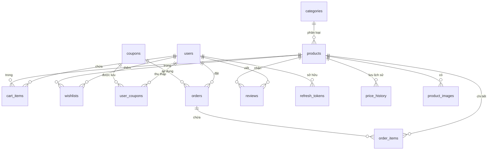
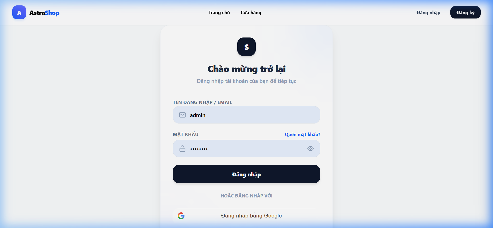
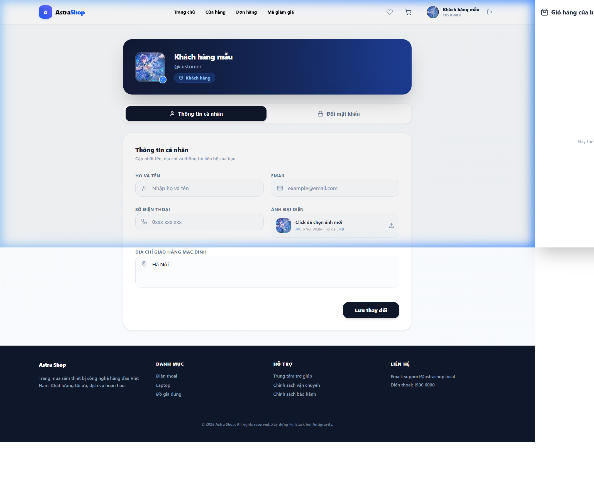
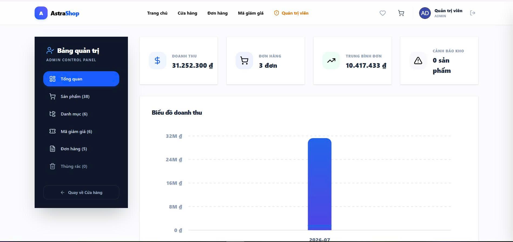
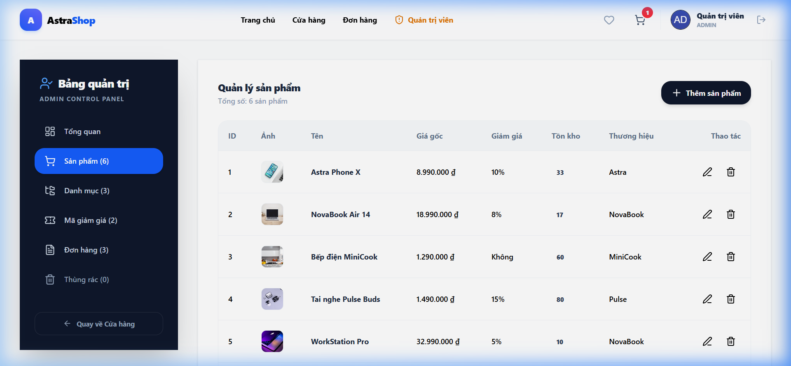
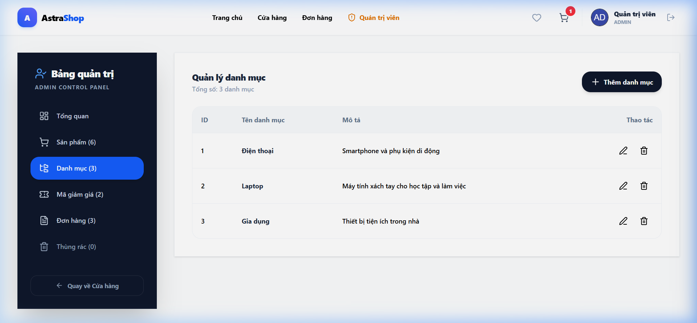
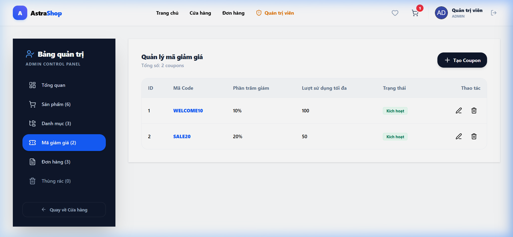
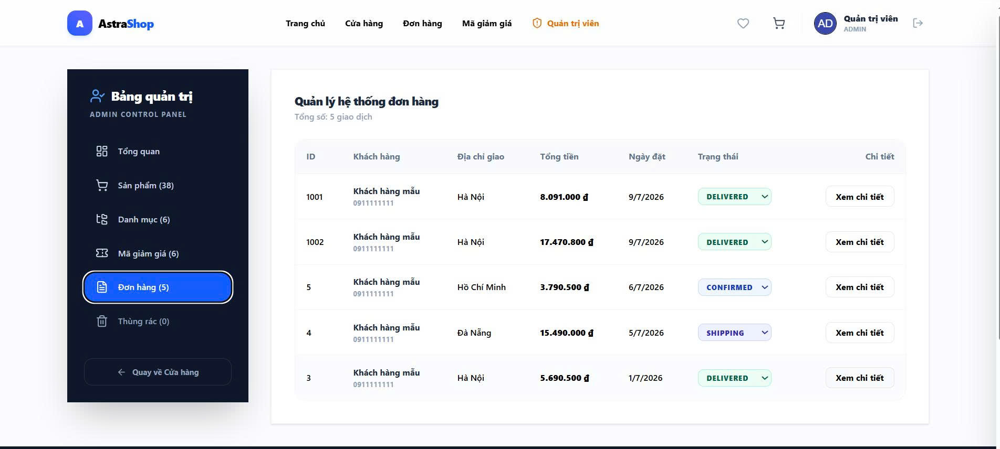
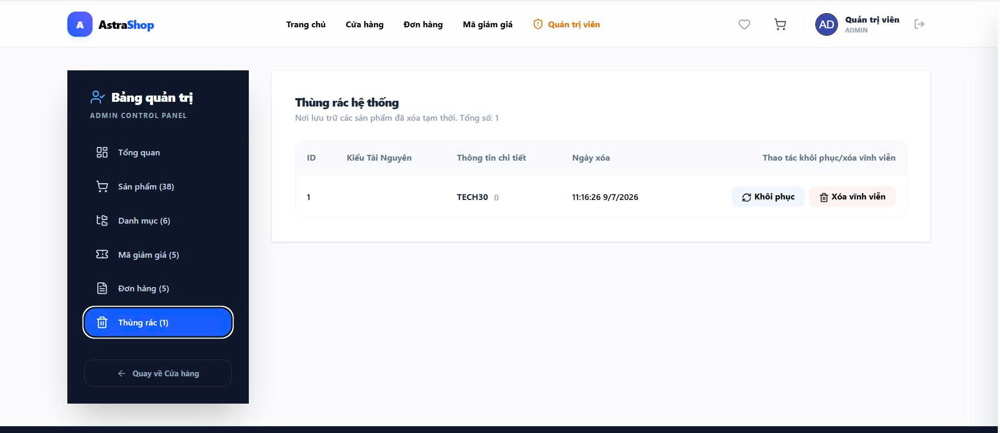

# 🛒 Mini E-Commerce System (Hệ thống Thương mại Điện tử Mini - AstraShop)

Dự án **Mini E-Commerce System** là một hệ thống bán hàng trực tuyến toàn diện, được xây dựng với kiến trúc **Monolithic** tinh gọn, hiện đại và chuẩn hóa. 

- **Backend**: Sử dụng **Java 21** và **Spring Boot 4.0.6**, tận dụng sức mạnh của **Spring Data JPA & Hibernate** để quản lý cơ sở dữ liệu **MySQL** một cách an toàn, nhất quán thông qua các cơ chế di chuyển lược đồ tự động với **Flyway**.
- **Frontend**: Được phát triển bằng **React 18/19 + TypeScript**, sử dụng **Vite** làm công cụ đóng gói siêu tốc, quản lý trạng thái giỏ hàng bằng **Zustand**, gọi API với **Axios**, và xây dựng giao diện đẹp mắt bằng **TailwindCSS (v4)**.

Hệ thống được tích hợp các cơ chế bảo mật cao cấp (JWT, Google OAuth2), các tính năng nâng cao như **Nhận thông báo giảm giá từ Wishlist**, **Thùng rác khôi phục dữ liệu (Recycle Bin)**, **Khóa dòng dữ liệu chống tranh chấp hàng tồn kho (Database Row Locking)**, và **Cập nhật thời gian thực (Realtime WebSockets)**.

---

## 📝 Tài Liệu & Báo Cáo Học Tập Backend
Để phục vụ yêu cầu kiểm thử và nộp báo cáo cho môn học, dự án đã chuẩn bị sẵn đầy đủ các tài liệu minh chứng:
*   **Tài liệu Thiết kế & Kiểm thử Backend:** Xem chi tiết tại **[bao_cao_backend.md](bao_cao_backend.md)**. Tài liệu bao gồm:
    *   Mô tả chi tiết các nhóm API nghiệp vụ (Auth, Catalog, Cart, Order, Review, Wishlist, Admin).
    *   Lược đồ CSDL chuẩn hóa (chuẩn **3NF**) kèm biểu đồ mối quan hệ thực thể **ERD** dưới dạng mã Mermaid.
    *   Hướng dẫn chạy thử chi tiết.
*   **Bộ Test API Toàn Diện 15 Kịch Bản:** 
    *   **Test tự động hóa (JUnit & MockMvc):** Mã nguồn nằm tại **[ApiControllerTests.java](file:///e:/WEBBANHANG/src/test/java/com/example/webbanhang/controller/ApiControllerTests.java)** với **15 kịch bản** (16 test cases bao gồm context load) kiểm thử toàn diện tất cả các luồng nghiệp vụ.
    *   **Test thủ công bằng REST Client:** File **[api-test-cases.http](file:///e:/WEBBANHANG/api-test-cases.http)** nằm ở thư mục gốc chứa các kịch bản gửi request trực quan qua REST Client.
*   **Tài liệu Swagger / OpenAPI:** Tích hợp trực tiếp qua thư viện `springdoc-openapi`.
    *   **Swagger UI (Web trực quan):** `http://localhost:8080/swagger-ui/index.html` (khi server đang chạy).
    *   **OpenAPI JSON Specification:** `http://localhost:8080/v3/api-docs`.

---

## 🚀 Điểm Nổi Bật Về Kỹ Thuật (Technical Highlights)

*   **Spring Data JPA & Hibernate**: Sử dụng JPA Repository để thao tác dữ liệu an toàn, khai báo quan hệ rõ ràng giữa các thực thể và tối ưu cơ chế nạp dữ liệu (Lazy/Eager loading).
*   **Database Row Locking (`SELECT ... FOR UPDATE`)**: Khi khách hàng tiến hành thanh toán (Checkout), hệ thống sẽ khóa các dòng sản phẩm tương ứng trong database để tránh tình trạng tranh chấp hàng tồn kho (race condition) khi nhiều luồng thanh toán cùng một sản phẩm cùng lúc.
*   **Realtime Communication (Spring WebSocket)**: Sử dụng WebSocket (`SimpMessagingTemplate`) để phát sóng thời gian thực (Broadcast) các sự kiện thay đổi tồn kho, tạo đơn hàng mới, cập nhật sản phẩm/danh mục tới tất cả khách hàng đang kết nối.
*   **Lịch sử biến động giá & Thông báo giảm giá**: Hệ thống tự động ghi lại lịch sử thay đổi giá gốc/giá khuyến mãi của sản phẩm. Khi sản phẩm trong Wishlist của người dùng được giảm giá (trong vòng 7 ngày gần nhất), hệ thống sẽ gửi thông báo giảm giá trực quan.
*   **Thùng rác hệ thống (Recycle Bin)**: Hỗ trợ xóa mềm (Soft Delete) đối với Sản phẩm, Danh mục, Người dùng, và Mã giảm giá. Dữ liệu bị xóa sẽ được nén dưới dạng JSON lưu vào bảng `recycle_bin` và có khả năng khôi phục (Restore) nguyên trạng hoàn toàn.
*   **Google One Tap Login**: Hợp nhất đăng nhập bằng Google OAuth2 một cách mượt mà ở phía Client và xác thực bảo mật ở phía Server thông qua Google API Token Info.

---

## 🌟 Danh Sách Tính Năng Chi Tiết (Feature List)

### 👤 Người dùng (Customer / Guest)
*   **Đăng ký & Đăng nhập**: Xác thực JWT token, mã hóa mật khẩu PBKDF2/BCrypt, kiểm tra độ phức tạp của mật khẩu và tính hợp lệ của số điện thoại. Tích hợp đăng nhập nhanh qua Google.
*   **Quản lý tài khoản**: Thay đổi mật khẩu, cập nhật thông tin cá nhân (Họ tên, SĐT, Địa chỉ, Avatar tự động qua Dicebear API).
*   **Quên mật khẩu & OTP**: Gửi mã OTP xác nhận đặt lại mật khẩu với thời gian hết hạn là 1 phút (OTP in ra Console hệ thống để test tiện lợi).
*   **Khám phá sản phẩm**: Tìm kiếm nâng cao, lọc theo Danh mục, mức giá (Min-Max Price), điểm đánh giá trung bình. Sắp xếp theo giá tăng/giảm dần, điểm đánh giá hoặc mới nhất.
*   **Yêu thích & Wishlist (Mới cập nhật)**: Thêm/xóa sản phẩm yêu thích hoạt động chính xác. Khách hàng có thể truy cập trang danh mục yêu thích và nhận thông báo giảm giá tự động nếu sản phẩm được giảm giá trong vòng 7 ngày qua.
*   **Giỏ hàng & Ví Voucher (Mới cập nhật)**:
    *   Thêm, bớt, cập nhật số lượng trực tiếp trong giỏ hàng.
    *   **Trang sưu tầm mã giảm giá:** Người dùng có thể vào trang `/vouchers` để thu thập các mã giảm giá đang hoạt động.
    *   **Quản lý mã giảm giá cá nhân:** Hiển thị danh sách các mã đang sở hữu, phân rõ mã có thể sử dụng và mã đã hết hạn/đã dùng.
    *   **Tự động áp dụng:** Khi nhấn nút "Dùng ngay" tại trang voucher, hệ thống sẽ tự động chuyển hướng và áp mã giảm giá đó vào giỏ hàng.
    *   **Chọn nhanh mã giảm giá:** Tại trang thanh toán, khi nhấn vào ô nhập mã giảm giá, một danh sách các mã giảm giá khả dụng của người dùng sẽ hiện lên để click chọn trực quan mà không cần gõ thủ công.
*   **Thanh toán & Đơn hàng**:
    *   Đặt hàng, chọn địa chỉ và ghi chú. Trừ tồn kho an toàn bằng Row Locking.
    *   Theo dõi trạng thái đơn hàng: `PENDING` (Chờ xác nhận) $\rightarrow$ `CONFIRMED` (Đã xác nhận) $\rightarrow$ `SHIPPING` (Đang giao) $\rightarrow$ `DELIVERED` (Đã giao) $\rightarrow$ `CANCELLED` (Đã hủy).
    *   Khách hàng có thể tự hủy đơn hàng khi đơn hàng đang ở trạng thái `PENDING`, tồn kho sẽ được hoàn lại tự động.
*   **Đánh giá sản phẩm (Mới cập nhật)**:
    *   **Logic chặt chẽ:** Chỉ những khách hàng đã mua và có đơn hàng được giao thành công (`DELIVERED`) đối với sản phẩm đó mới được viết đánh giá (1-5 sao) và bình luận.
    *   **Dữ liệu mẫu sinh động:** Đã seed sẵn các đánh giá và bình luận mẫu vào cơ sở dữ liệu để trang sản phẩm hiển thị đầy đủ và trực quan.

### 👑 Quản trị viên (Admin)
*   **Dashboard Thống kê**:
    *   Thống kê doanh thu, số lượng đơn hàng, sản phẩm và khách hàng theo thời gian (Hôm nay, Tuần này, Tháng này, Năm này).
    *   Biểu đồ doanh thu trực quan, cơ cấu doanh thu theo Danh mục sản phẩm, và danh sách các sản phẩm bán chạy nhất.
    *   Cảnh báo sản phẩm sắp hết hàng (Tồn kho dưới 10).
*   **Quản lý danh mục & sản phẩm**:
    *   CRUD Danh mục & Sản phẩm, cập nhật ảnh sản phẩm qua upload file tĩnh.
    *   Chuyển đổi danh mục hàng loạt cho nhiều sản phẩm cùng lúc (Bulk update category).
    *   Xem lịch sử thay đổi giá của từng sản phẩm.
    *   Ràng buộc bảo mật dữ liệu: Không cho phép xóa cứng sản phẩm đã từng phát sinh đơn hàng (ngăn ngừa lỗi toàn vẹn tham chiếu).
*   **Quản lý Voucher & Đơn hàng (Mới cập nhật)**:
    *   Tạo mã coupon với hạn sử dụng, phần trăm giảm giá và giới hạn số lượt phát hành tối đa (`max_uses`).
    *   **Điều chỉnh thời hạn hết hạn:** Tại màn hình quản lý voucher của Admin, hỗ trợ tùy chỉnh ngày bắt đầu và ngày hết hạn một cách trực quan.
    *   Cập nhật trạng thái đơn hàng. Nếu chuyển sang trạng thái `CANCELLED`, tồn kho sản phẩm sẽ được tự động cộng trả lại.
*   **Quản lý tài khoản & Thùng rác**:
    *   Khóa tài khoản khách hàng (`BANNED`) có thời hạn hoặc vĩnh viễn. Không cho phép xóa khách hàng đã có lịch sử đơn hàng để bảo vệ dữ liệu báo cáo tài chính.
    *   Thùng rác hệ thống: Khôi phục nhanh hoặc xóa vĩnh viễn các thực thể đã xóa mềm (User, Product, Category, Coupon).

---

## 🗄️ Thiết Kế Cơ Sở Dữ Liệu (Database Schema)

Hệ thống sử dụng 16 bảng (bao gồm 15 bảng nghiệp vụ và 1 bảng hệ thống của Flyway) được liên kết chặt chẽ trong MySQL:



### Danh sách 16 bảng trong Cơ sở dữ liệu:
1.  **`users`**: Quản lý tài khoản người dùng (Khách hàng và Admin).
2.  **`categories`**: Quản lý các danh mục sản phẩm.
3.  **`products`**: Quản lý thông tin chi tiết và số lượng tồn kho của sản phẩm.
4.  **`product_images`**: Lưu các hình ảnh phụ bổ sung cho sản phẩm (quan hệ 1-N với `products`).
5.  **`cart_items`**: Quản lý các sản phẩm trong giỏ hàng tạm thời của khách hàng.
6.  **`orders`**: Quản lý thông tin chung của đơn hàng (tổng tiền, giảm giá, địa chỉ giao hàng, trạng thái).
7.  **`order_items`**: Lưu chi tiết các mặt hàng, số lượng và giá cụ thể tại thời điểm mua trong đơn hàng.
8.  **`reviews`**: Lưu đánh giá số sao (1-5) và bình luận từ khách hàng đã mua sản phẩm.
9.  **`coupons`**: Quản lý các mã giảm giá toàn hệ thống.
10. **`user_coupons`**: Ví lưu trữ các mã giảm giá cá nhân mà khách hàng đã thu thập/sưu tầm được.
11. **`wishlists`**: Lưu trữ danh sách các sản phẩm yêu thích của khách hàng.
12. **`price_history`**: Ghi lại lịch sử các lần thay đổi giá của sản phẩm để phục vụ tính năng gửi thông báo khi có sản phẩm yêu thích được giảm giá.
13. **`recycle_bin`**: Thùng rác hệ thống dùng lưu trữ các thực thể bị xóa mềm dưới dạng JSON nhằm hỗ trợ chức năng khôi phục.
14. **`password_resets`**: Quản lý mã OTP và thời gian hết hạn phục vụ quy trình lấy lại mật khẩu.
15. **`refresh_tokens`**: Lưu trữ Refresh Token phục vụ cơ chế tự động làm mới JWT Access Token.
16. **`flyway_schema_history`**: Bảng hệ thống được tạo tự động bởi Flyway để giám sát phiên bản cấu trúc database.

---

## 📂 Cấu Trúc Thư Mục Dự Án (Folder Structure)

```text
Webbanhang/
├── frontend/                 # --- DỰ ÁN FRONTEND (React 18 + TS) ---
│   ├── src/
│   │   ├── components/       # Các component dùng chung (CartDrawer, ProductCard, FilterSidebar...)
│   │   ├── pages/            # Các trang giao diện (Home, ProductList, ProductDetail, Checkout, Admin...)
│   │   ├── services/         # Axios config API kết nối đến Backend
│   │   ├── store/            # Quản lý State bằng Zustand (useCartStore, useAuthStore)
│   │   ├── types/            # Định nghĩa Interface TypeScript
│   │   └── App.tsx           # Router chính (React Router Dom v6)
│   ├── package.json          # Quản lý thư viện và script chạy
│   └── vite.config.ts        # Cấu hình Vite & Proxy kết nối API backend
├── src/                      # --- DỰ ÁN BACKEND (Spring Boot) ---
│   ├── main/
│   │   ├── java/com/example/webbanhang/
│   │   │   ├── common/       # Lớp tiện ích JSONHelper, ApiResponse chung
│   │   │   ├── config/       # Flyway, WebSocketConfig, WebMvcConfig
│   │   │   ├── controller/   # API Controllers (Auth, Catalog, Cart, Upload)
│   │   │   │   └── admin/    # AdminController quản lý dashboard, CRUD và Recycle Bin
│   │   │   ├── domain/       # Các Entity JPA (User, Product, Category, Order, CartItem...)
│   │   │   ├── dto/          # Data Transfer Objects (Requests & Responses)
│   │   │   ├── exception/    # Tầng bắt lỗi tập trung (GlobalExceptionHandler)
│   │   │   ├── repository/   # Spring Data JPA Repositories
│   │   │   ├── security/     # Cấu hình Spring Security, JWT Service, Auth Filters
│   │   │   └── service/      # Business Logic Services (AuthService, ShopService, CatalogService)
│   │   └── resources/
│   │       ├── db/migration/ # Các file SQL migrations của Flyway
│   │       ├── static/       # Chứa thư mục uploads ảnh và các file build tĩnh của React frontend
│   │       └── application.properties # Cấu hình ứng dụng (Port, Database URL, JWT Secret...)
```

---

## ⚙️ Hướng Dẫn Cài Đặt & Vận Hành (Setup & Running Guide)

### 📋 Yêu cầu hệ thống
*   **Java**: Phiên bản JDK 21 trở lên.
*   **Node.js**: Phiên bản 18 trở lên.
*   **Maven**: Bản 3.8+ (đã tích hợp sẵn Maven Wrapper trong dự án làm công cụ chạy tiện lợi).
*   **Database**: MySQL Server 8.0 trở lên.

### 🛠️ Các bước khởi động nhanh

#### Bước 1: Chuẩn bị Cơ sở dữ liệu MySQL
1. Khởi động MySQL Server của bạn.
2. Tạo cơ sở dữ liệu `webbanhang` bằng lệnh:
   ```sql
   CREATE DATABASE webbanhang CHARACTER SET utf8mb4 COLLATE utf8mb4_unicode_ci;
   ```

#### Bước 2: Chạy Frontend ở chế độ Development (Local Dev)
1. Di chuyển vào thư mục frontend:
   ```bash
   cd frontend
   ```
2. Cài đặt các thư viện phụ thuộc:
   ```bash
   npm install
   ```
3. Khởi chạy Vite dev server (chạy trên cổng `3000`, tự động proxy sang backend cổng `8080`):
   ```bash
   npm run dev
   ```

#### Bước 3: Đóng gói và chạy dự án (Production Bundle)
1. Build frontend React:
   ```bash
   cd frontend
   ```
   *Quá trình build sẽ kết xuất sản phẩm ra thư mục `frontend/dist`.*
2. Trở lại thư mục gốc của dự án và khởi chạy Spring Boot:
   ```powershell
   # Trên Windows (PowerShell)
   .\mvnw.cmd spring-boot:run
   ```
   *Maven sẽ tự động copy các file tĩnh từ `frontend/dist` sang `target/classes/static` và phục vụ tại địa chỉ `http://localhost:8080`.*

---

## 🔑 Danh Sách Tài Khoản Mẫu (Sample Seed Accounts)

Sau khi khởi chạy, Flyway sẽ tự động chạy các tệp migrations và seed các tài khoản thử nghiệm sau:

| Vai trò (Role) | Tên đăng nhập (Username) | Mật khẩu (Password) | Email liên kết | Mô tả mục đích sử dụng |
| :--- | :--- | :--- | :--- | :--- |
| **Quản trị viên** | `admin` | `admin123` | `admin@shop.local` | Có toàn quyền quản trị, truy cập giao diện Admin Dashboard để quản lý sản phẩm, đơn hàng, người dùng, thùng rác. |
| **Khách hàng mẫu** | `customer` | `customer123` | `customer@shop.local` | Tài khoản khách hàng mẫu để test chức năng giỏ hàng, đặt hàng, sưu tầm voucher, viết đánh giá và tích điểm thăng hạng. |

---

## 📸 Review & Demo các Chức năng Hệ thống

Dưới đây là một số hình ảnh và video thực tế ghi lại từ hệ thống khi vận hành:

### 📽️ Video Demo quy trình mua hàng & quản trị:
- **Khách hàng mua hàng & Thanh toán**: [customer_flow_demo.webp](images/customer_flow_demo.webp)
- **Quản trị viên quản lý Dashboard**: [admin_flow_demo.webp](images/admin_flow_demo.webp)

### 🖼️ Hình ảnh các trang chức năng:

#### 1. Màn hình Đăng nhập & Đăng ký:


#### 2. Hồ sơ cá nhân:


#### 3. Admin Dashboard & Thống kê doanh thu:


#### 4. Admin - Quản lý Sản phẩm (CRUD):


#### 5. Admin - Quản lý Danh mục:


#### 6. Admin - Mã giảm giá (Coupon):


#### 7. Admin - Đơn hàng & Cập nhật trạng thái:


#### 8. Admin - Thùng rác khôi phục dữ liệu (Recycle Bin):

