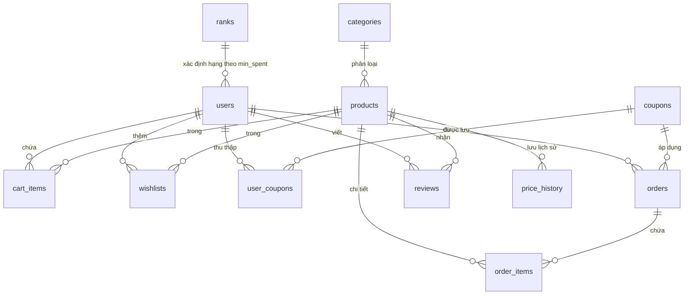

# 🛒 Mini E-Commerce System (Hệ thống Thương mại Điện tử Mini)

Dự án **Mini E-Commerce System** là một hệ thống bán hàng trực tuyến toàn diện, được xây dựng với kiến trúc **Monolithic** tinh gọn. Backend sử dụng **Java 21** và **Spring Boot**, tận dụng tối đa hiệu năng của **Spring JDBC (JdbcTemplate)** để tối ưu hóa truy vấn dữ liệu trực tiếp đến **MySQL** mà không cần qua tầng ORM cồng kềnh. Frontend được xây dựng bằng **HTML5, Vanilla CSS, và Modern JavaScript**, phục vụ trực tiếp (Single-page app-like experience) từ static resource của Spring Boot.

Hệ thống được tích hợp các cơ chế bảo mật cao cấp (JWT, Google OAuth2), các tính năng nâng cao như **Phân hạng thành viên (User Ranking Gamification)**, **Nhận thông báo giảm giá từ Wishlist**, **Thùng rác khôi phục dữ liệu (Recycle Bin)**, **Khóa dòng dữ liệu chống tranh chấp hàng tồn kho (Database Row Locking)**, và **Cập nhật thời gian thực (Realtime WebSockets)**.

---

## 🚀 Điểm Nổi Bật Về Kỹ Thuật (Technical Highlights)

*   **Spring JdbcTemplate & Custom Mapping**: Toàn bộ dữ liệu được truy xuất trực tiếp qua SQL thuần túy bằng `JdbcTemplate`, giúp lập trình viên kiểm soát tuyệt đối hiệu năng câu lệnh SQL, tránh được các vấn đề n+1 query của Hibernate.
*   **Database Row Locking (`SELECT ... FOR UPDATE`)**: Khi khách hàng tiến hành thanh toán (Checkout), hệ thống sẽ lock các dòng sản phẩm tương ứng trong database để tránh tình trạng race condition khi nhiều luồng thanh toán cùng một sản phẩm cùng lúc.
*   **Realtime Communication (Spring WebSocket)**: Sử dụng WebSocket (`SimpMessagingTemplate`) để phát sóng thời gian thực (Broadcast) các sự kiện thay đổi tồn kho, tạo đơn hàng mới, cập nhật sản phẩm/danh mục tới tất cả khách hàng đang kết nối.
*   **Lịch sử biến động giá & Thông báo giảm giá**: Hệ thống tự động ghi lại lịch sử thay đổi giá gốc/giá khuyến mãi của sản phẩm. Khi sản phẩm trong Wishlist của người dùng được giảm giá (trong vòng 7 ngày gần nhất), hệ thống sẽ gửi thông báo giảm giá trực quan.
*   **Thùng rác hệ thống (Recycle Bin)**: Hỗ trợ xóa mềm (Soft Delete) đối với Sản phẩm, Danh mục, Người dùng, và Mã giảm giá. Dữ liệu bị xóa sẽ được nén dưới dạng JSON lưu vào bảng `recycle_bin` và có khả năng khôi phục (Restore) nguyên trạng hoàn toàn.
*   **Google One Tap Login**: Hợp nhất đăng nhập bằng Google OAuth2 một cách mượt mà ở phía Client và xác thực bảo mật ở phía Server thông qua Google API Token Info.

---

## 🌟 Danh Sách Tính Năng Chi Tiết (Feature List)

### 👤 Người dùng (Customer / Guest)
*   **Đăng ký & Đăng nhập**: Xác thực JWT token, mã hóa mật khẩu PBKDF2/BCrypt, kiểm tra độ phức tạp của mật khẩu và tính hợp lệ của số điện thoại. Tích hợp đăng nhập nhanh qua Google.
*   **Quản lý tài khoản**: Thay đổi mật khẩu, cập nhật thông tin cá nhân (Họ tên, SĐT, Địa chỉ, Avatar tự động qua Dicebear API).
*   **Quên mật khẩu & OTP**: Gửi mã OTP xác nhận đặt lại mật khẩu với thời gian hết hạn là 1 phút (OTP in ra Console hệ thống để test tiện lợi).
*   **Khám phá sản phẩm**: Tìm kiếm nâng cao, lọc theo Danh mục, mức giá (Min-Max Price), điểm đánh giá trung bình. Sắp xếp theo giá tăng/giảm dần, điểm đánh giá hoặc mới nhất.
*   **Yêu thích & Wishlist**: Thêm/xóa sản phẩm yêu thích và nhận thông báo giảm giá tự động nếu sản phẩm được giảm giá trong vòng 7 ngày qua.
*   **Giỏ hàng & Ví Voucher**:
    *   Thêm, bớt, cập nhật số lượng trực tiếp trong giỏ hàng.
    *   Ví Voucher: Khách hàng phải thu thập mã giảm giá (Coupon) từ mục Voucher vào ví của mình trước, sau đó mới có thể áp dụng khi thanh toán. Hệ thống giới hạn mỗi voucher chỉ được sử dụng 1 lần duy nhất trên mỗi tài khoản.
*   **Thanh toán & Đơn hàng**:
    *   Đặt hàng, chọn địa chỉ và ghi chú. Trừ tồn kho an toàn bằng Row Locking.
    *   Theo dõi trạng thái đơn hàng: `PENDING` (Chờ xác nhận) $\rightarrow$ `CONFIRMED` (Đã xác nhận) $\rightarrow$ `SHIPPING` (Đang giao) $\rightarrow$ `DELIVERED` (Đã giao) $\rightarrow$ `CANCELLED` (Đã hủy).
    *   Khách hàng có thể tự hủy đơn hàng khi đơn hàng đang ở trạng thái `PENDING`, tồn kho sẽ được hoàn lại tự động.
*   **Đánh giá sản phẩm**: Viết nhận xét và chấm điểm (1-5 sao) sau khi đơn hàng được chuyển sang trạng thái `DELIVERED`. Mỗi khách hàng chỉ được đánh giá sản phẩm đó tối đa 1 lần.
*   **Phân hạng thành viên (User Gamification Ranks)**:
    *   Tự động nâng cấp hạng người dùng dựa trên tổng số tiền đã chi tiêu thành công:
        *   **Shopper** (Mới tham gia - chi tiêu từ 0đ)
        *   **Shark** (Cá mập tập sự - từ 500kđ)
        *   **Angel Investor** (Nhà đầu tư thiên thần - từ 2.0Mđ)
        *   **Unicorn** (Kỳ lân công nghệ - từ 5.0Mđ)
        *   **Tycoon** (Trùm tài phiệt - từ 15.0Mđ)
    *   Hạng thành viên hiển thị với huy hiệu (Badge) màu sắc lấp lánh trên giao diện.

### 👑 Quản trị viên (Admin)
*   **Dashboard Thống kê**:
    *   Thống kê doanh thu, số lượng đơn hàng, sản phẩm và khách hàng theo thời gian (Hôm nay, Tuần này, Tháng này, Năm này).
    *   Biểu đồ doanh thu trực quan, cơ cấu doanh thu theo Danh mục sản phẩm, và danh sách các sản phẩm bán chạy nhất.
    *   Cảnh báo sản phẩm sắp hết hàng (Tồn kho dưới 10).
*   **Quản lý danh mục & sản phẩm**:
    *   CRUD Danh mục & Sản phẩm, cập nhật ảnh sản phẩm qua upload file tĩnh.
    *   Chuyển đổi danh mục hàng loạt cho nhiều sản phẩm cùng lúc (Bulk update category).
    *   Xem lịch sử thay đổi giá của từng sản phẩm.
    *   Ràng buộc bảo mật dữ liệu: Không cho phép xóa cứng sản phẩm đã từng phát sinh đơn hàng (ngăn ngừa lỗi toàn vẹn tham chiếu).
*   **Quản lý Voucher & Đơn hàng**:
    *   Tạo mã coupon với hạn sử dụng, phần trăm giảm giá và giới hạn số lượt phát hành tối đa (`max_uses`).
    *   Cập nhật trạng thái đơn hàng. Nếu chuyển sang trạng thái `CANCELLED`, tồn kho sản phẩm sẽ được tự động cộng trả lại.
*   **Quản lý tài khoản & Thùng rác**:
    *   Khóa tài khoản khách hàng (`BANNED`) có thời hạn hoặc vĩnh viễn. Không cho phép xóa khách hàng đã có lịch sử đơn hàng để bảo vệ dữ liệu báo cáo tài chính.
    *   Thùng rác hệ thống: Khôi phục nhanh hoặc xóa vĩnh viễn các thực thể đã xóa mềm (User, Product, Category, Coupon).

---

## 🗄️ Thiết Kế Cơ Sở Dữ Liệu (Database Schema)

Hệ thống sử dụng các bảng liên kết chặt chẽ trong MySQL:



### Chi tiết các bảng chính:
1.  **users**: Thông tin người dùng, vai trò (`ADMIN`, `CUSTOMER`), trạng thái (`ACTIVE`, `BANNED`), thời gian khóa (`ban_until`), họ tên, địa chỉ, số điện thoại, link ảnh đại diện.
2.  **categories**: Tên và mô tả danh mục sản phẩm.
3.  **products**: Thông tin sản phẩm, giá bán, số lượng tồn kho, phần trăm giảm giá, danh mục liên kết, cờ sản phẩm nổi bật (`featured`).
4.  **price_history**: Lưu lại giá trị giá gốc cũ/mới và phần trăm giảm giá cũ/mới mỗi khi sản phẩm được cập nhật giá, hỗ trợ tính năng thông báo giảm giá Wishlist.
5.  **coupons**: Mã giảm giá, phần trăm giảm giá, giới hạn số lần phát hành (`max_uses`), số lần đã sử dụng (`used_count`), thời gian hiệu lực.
6.  **user_coupons**: Ví voucher của từng người dùng, liên kết n-n giữa `users` và `coupons`.
7.  **cart_items**: Các sản phẩm đang nằm trong giỏ hàng của khách hàng.
8.  **wishlists**: Bookmark sản phẩm yêu thích của khách hàng.
9.  **orders**: Thông tin đơn hàng tổng quát, số tiền thanh toán, số tiền được giảm, trạng thái giao nhận, địa chỉ người nhận.
10. **order_items**: Chi tiết sản phẩm trong đơn hàng tại thời điểm mua (lưu lại snapshot giá bán và tên sản phẩm lúc thanh toán).
11. **reviews**: Đánh giá sản phẩm từ người dùng (liên kết duy nhất: một người dùng chỉ đánh giá một sản phẩm tối đa một lần).
12. **ranks**: Định nghĩa các mốc chi tiêu tối thiểu (`min_spent`), tiêu đề, biểu tượng cảm xúc và màu sắc tương ứng cho từng hạng thành viên.
13. **recycle_bin**: Lưu dữ liệu sao lưu của các thực thể bị xóa dưới dạng cấu trúc JSON, ghi nhận thời điểm xóa.
14. **password_resets**: Quản lý OTP khôi phục mật khẩu.

---

## 📂 Cấu Trúc Thư Mục Dự Án (Folder Structure)

```text
Webbanhang/
├── src/
│   ├── main/
│   │   ├── java/com/example/webbanhang/
│   │   │   ├── common/              # Lớp tiện ích JSONHelper, ApiResponse chung
│   │   │   ├── config/              # Khởi tạo DB tự động (DataInitializer), WebSocketConfig, WebMvcConfig
│   │   │   ├── controller/          # Tầng tiếp nhận HTTP Request APIs
│   │   │   │   └── admin/           # APIs quản trị AdminController
│   │   │   ├── domain/              # Enums định nghĩa trạng thái đơn hàng và phân quyền
│   │   │   ├── dto/                 # Lớp định dạng dữ liệu vào/ra (Record Requests/Responses)
│   │   │   ├── exception/           # Xử lý lỗi tập trung toàn hệ thống (GlobalExceptionHandler)
│   │   │   ├── security/            # Cấu hình Spring Security, JWT Token Service, Filter xác thực
│   │   │   └── service/             # Tầng xử lý nghiệp vụ chính (Auth, Catalog, Shop, RecycleBin, Realtime)
│   │   └── resources/
│   │       ├── static/              # Frontend tĩnh (index.html, styles.css, app.js)
│   │       └── application.properties # Cấu hình môi trường chạy (Cổng mạng, Kết nối DB, JWT Secret...)
```

---

## ⚙️ Hướng Dẫn Cài Đặt & Vận Hành (Setup & Running Guide)

### 📋 Yêu cầu hệ thống
*   **Java**: Phiên bản JDK 21 trở lên.
*   **Maven**: Bản 3.8+ (đã tích hợp sẵn Maven Wrapper trong dự án làm công cụ chạy tiện lợi).
*   **Database**: MySQL Server 8.0 trở lên.

### 🛠️ Các bước khởi động nhanh

#### Bước 1: Chuẩn bị Cơ sở dữ liệu MySQL
1. Khởi động MySQL Server của bạn.
2. Đảm bảo cổng hoạt động mặc định là `3306`.
3. Hệ thống hỗ trợ **tự động tạo database** `webbanhang` nếu nó chưa tồn tại khi ứng dụng khởi chạy lần đầu (yêu cầu tài khoản MySQL có quyền `CREATE DATABASE`). Bạn cũng có thể tạo tay bằng lệnh:
   ```sql
   CREATE DATABASE webbanhang CHARACTER SET utf8mb4 COLLATE utf8mb4_unicode_ci;
   ```

#### Bước 2: Chạy ứng dụng Spring Boot

*   **Trường hợp 1: Tài khoản MySQL `root` không đặt mật khẩu hoặc dùng mật khẩu mặc định của dự án (`123456`)**:
    Mở Terminal tại thư mục gốc của dự án và chạy trực tiếp lệnh:
    ```powershell
    # Trên Windows (PowerShell)
    .\mvnw.cmd spring-boot:run
    
    # Trên Linux / macOS
    ./mvnw spring-boot:run
    ```

*   **Trường hợp 2: Tài khoản MySQL có mật khẩu riêng hoặc địa chỉ IP khác**:
    Hãy cung cấp mật khẩu hoặc các tham số cấu hình qua biến môi trường trước khi khởi động:
    ```powershell
    # Trên Windows (PowerShell)
    $env:DB_PASSWORD='mat-khau-mysql-cua-ban'
    .\mvnw.cmd spring-boot:run
    
    # Trên Windows (Command Prompt)
    set DB_PASSWORD=mat-khau-mysql-cua-ban
    mvnw spring-boot:run
    
    # Trên Linux / macOS
    DB_PASSWORD='mat-khau-mysql-cua-ban' ./mvnw spring-boot:run
    ```

#### Bước 3: Truy cập Giao diện người dùng
Khi thấy log thông báo khởi động thành công trên cổng `8080`, hãy truy cập trình duyệt tại địa chỉ:
```text
http://localhost:8080
```

---

## 🔑 Danh Sách Tài Khoản Mẫu (Sample Seed Accounts)

Ngay sau khi kết nối cơ sở dữ liệu thành công, hệ thống tự động khởi tạo các bảng và seed các tài khoản thử nghiệm sau:

| Vai trò (Role) | Tên đăng nhập (Username) | Mật khẩu (Password) | Email liên kết | Mô tả mục đích sử dụng |
| :--- | :--- | :--- | :--- | :--- |
| **Quản trị viên** | `admin` | `admin123` | `admin@shop.local` | Có toàn quyền quản trị, truy cập giao diện Admin Dashboard để quản lý sản phẩm, đơn hàng, người dùng, thùng rác. |
| **Khách hàng mẫu** | `customer` | `customer123` | `customer@shop.local` | Tài khoản khách hàng mẫu để test chức năng giỏ hàng, đặt hàng, sưu tầm voucher, viết đánh giá và tích điểm thăng hạng. |

---

## 🌐 Các Biến Cấu Hợp Môi Trường (Environment Variables)

Bạn có thể tùy biến các cấu hình sâu hơn của ứng dụng bằng các biến môi trường sau:

| Tên biến môi trường | Mô tả cấu hình | Giá trị mặc định |
| :--- | :--- | :--- |
| `DB_URL` | Chuỗi kết nối JDBC MySQL | `jdbc:mysql://127.0.0.1:3306/webbanhang?createDatabaseIfNotExist=true&...` |
| `DB_USERNAME` | Tên tài khoản quản trị MySQL | `root` |
| `DB_PASSWORD` | Mật khẩu tài khoản MySQL | `123456` |
| `JWT_SECRET` | Khóa bí mật dùng ký tên mã JWT | *Khóa ngẫu nhiên tự tạo trong code* |
| `JWT_EXPIRATION_MINUTES` | Thời gian sống của JWT token (phút) | `720` (12 giờ) |
| `UPLOAD_DIR` | Thư mục lưu trữ ảnh tải lên | `uploads` |

