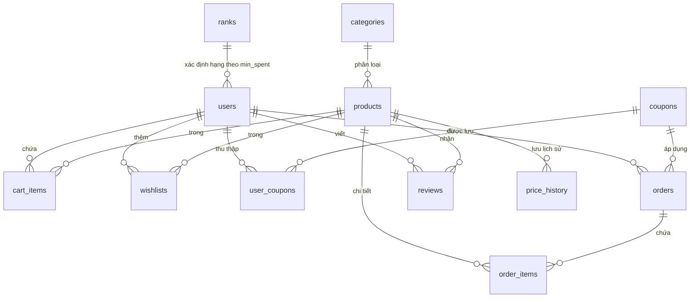

# 🛒 Mini E-Commerce System (Hệ thống Thương mại Điện tử Mini)

Dự án **Mini E-Commerce System** là một hệ thống bán hàng trực tuyến toàn diện, được xây dựng với kiến trúc **Monolithic** tinh gọn, hiện đại và chuẩn hóa. 

- **Backend**: Sử dụng **Java 21** và **Spring Boot 4.0.6**, tận dụng sức mạnh của **Spring Data JPA & Hibernate** để quản lý cơ sở dữ liệu **MySQL** một cách an toàn, nhất quán thông qua các cơ chế di chuyển lược đồ tự động với **Flyway**.
- **Frontend**: Được phát triển bằng **React 18/19 + TypeScript**, sử dụng **Vite** làm công cụ đóng gói siêu tốc, quản lý trạng thái giỏ hàng bằng **Zustand**, gọi API với **Axios**, và xây dựng giao diện đẹp mắt bằng **TailwindCSS (v4)**.

Hệ thống được tích hợp các cơ chế bảo mật cao cấp (JWT, Google OAuth2), các tính năng nâng cao như **Phân hạng thành viên (User Ranking Gamification)**, **Nhận thông báo giảm giá từ Wishlist**, **Thùng rác khôi phục dữ liệu (Recycle Bin)**, **Khóa dòng dữ liệu chống tranh chấp hàng tồn kho (Database Row Locking)**, và **Cập nhật thời gian thực (Realtime WebSockets)**.

---

## 🚀 Điểm Nổi Bật Về Kỹ Thuật (Technical Highlights)

*   **Spring Data JPA & Hibernate**: Sử dụng JPA Repository để thao tác dữ liệu an toàn, khai báo quan hệ rõ ràng giữa các thực thể và tận dụng tối đa cơ chế nạp dữ liệu (Lazy/Eager loading) tối ưu.
*   **Database Row Locking (`SELECT ... FOR UPDATE`)**: Khi khách hàng tiến hành thanh toán (Checkout), hệ thống sẽ lock các dòng sản phẩm tương ứng trong database để tránh tình trạng tranh chấp hàng tồn kho (race condition) khi nhiều luồng thanh toán cùng một sản phẩm cùng lúc.
*   **Realtime Communication (Spring WebSocket)**: Sử dụng WebSocket (`SimpMessagingTemplate`) để phát sóng thời gian thực (Broadcast) các sự kiện thay đổi tồn kho, tạo đơn hàng mới, cập nhật sản phẩm/danh mục tới tất cả khách hàng đang kết nối.
*   **Lịch sử biến động giá & Thông báo giảm giá**: Hệ thống tự động ghi lại lịch sử thay đổi giá gốc/giá khuyến mãi của sản phẩm. Khi sản phẩm trong Wishlist của người dùng được giảm giá (trong vòng 7 ngày gần nhất), hệ thống sẽ gửi thông báo giảm giá trực quan.
*   **Thùng rác hệ thống (Recycle Bin)**: Hỗ trợ xóa mềm (Soft Delete) đối với Sản phẩm, Danh mục, Người dùng, và Mã giảm giá. Dữ liệu bị xóa sẽ được nén dưới dạng JSON lưu vào bảng `recycle_bin` và có khả năng khôi phục (Restore) nguyên trạng hoàn toàn.
*   **Google One Tap Login**: Hợp nhất đăng nhập bằng Google OAuth2 một cách mượt mà ở phía Client và xác thực bảo mật ở phía Server thông qua Google API Token Info.

---

## 🌟 Danh Sách Tính Năng Chi Tiết (Feature List)

### 👤 Người dùng (Customer / Guest)
*   **Đăng ký & Đăng nhập**: Xác thực JWT token, mã hóa mật khẩu PBKDF2/BCrypt, kiểm tra độ phức tạp của mật khẩu và tính hợp lệ của số điện thoại. Tích hợp đăng nhập nhanh qua Google.
*   **Quản lý tài khoản**: Thay đổi mật khẩu, cập nhật thông tin cá nhân (Họ tên, SĐT, Địa chỉ, Avatar tự động qua Dicebear API).
*   **Quên mật khẩu & OTP**: Gửi mã OTP xác nhận đặt lại mật khẩu với thời gian hết hạn là 1 phút (OTP in ra Console hệ thống để test tiện lợi).
*   **Khám phá sản phẩm**: Tìm kiếm nâng cao, lọc theo Danh mục, mức giá (Min-Max Price), điểm đánh giá trung bình. Sắp xếp theo giá tăng/giảm dần, điểm đánh giá hoặc mới nhất.
*   **Yêu thích & Wishlist**: Thêm/xóa sản phẩm yêu thích và nhận thông báo giảm giá tự động nếu sản phẩm được giảm giá trong vòng 7 ngày qua.
*   **Giỏ hàng & Ví Voucher**:
    *   Thêm, bớt, cập nhật số lượng trực tiếp trong giỏ hàng.
    *   Ví Voucher: Khách hàng phải thu thập mã giảm giá (Coupon) từ mục Voucher vào ví của mình trước, sau đó mới có thể áp dụng khi thanh toán. Hệ thống giới hạn mỗi voucher chỉ được sử dụng 1 lần duy nhất trên mỗi tài khoản.
*   **Thanh toán & Đơn hàng**:
    *   Đặt hàng, chọn địa chỉ và ghi chú. Trừ tồn kho an toàn bằng Row Locking.
    *   Theo dõi trạng thái đơn hàng: `PENDING` (Chờ xác nhận) $\rightarrow$ `CONFIRMED` (Đã xác nhận) $\rightarrow$ `SHIPPING` (Đang giao) $\rightarrow$ `DELIVERED` (Đã giao) $\rightarrow$ `CANCELLED` (Đã hủy).
    *   Khách hàng có thể tự hủy đơn hàng khi đơn hàng đang ở trạng thái `PENDING`, tồn kho sẽ được hoàn lại tự động.
*   **Đánh giá sản phẩm**: Viết nhận xét và chấm điểm (1-5 sao) sau khi đơn hàng được chuyển sang trạng thái `DELIVERED`. Mỗi khách hàng chỉ được đánh giá sản phẩm đó tối đa 1 lần.
*   **Phân hạng thành viên (User Gamification Ranks)**:
    *   Tự động nâng cấp hạng người dùng dựa trên tổng số tiền đã chi tiêu thành công:
        *   **Shopper** (Mới tham gia - chi tiêu từ 0đ)
        *   **Shark** (Cá mập tập sự - từ 500kđ)
        *   **Angel Investor** (Nhà đầu tư thiên thần - từ 2.0Mđ)
        *   **Unicorn** (Kỳ lân công nghệ - từ 5.0Mđ)
        *   **Tycoon** (Trùm tài phiệt - từ 15.0Mđ)
    *   Hạng thành viên hiển thị với huy hiệu (Badge) màu sắc lấp lánh trên giao diện.

### 👑 Quản trị viên (Admin)
*   **Dashboard Thống kê**:
    *   Thống kê doanh thu, số lượng đơn hàng, sản phẩm và khách hàng theo thời gian (Hôm nay, Tuần này, Tháng này, Năm này).
    *   Biểu đồ doanh thu trực quan, cơ cấu doanh thu theo Danh mục sản phẩm, và danh sách các sản phẩm bán chạy nhất.
    *   Cảnh báo sản phẩm sắp hết hàng (Tồn kho dưới 10).
*   **Quản lý danh mục & sản phẩm**:
    *   CRUD Danh mục & Sản phẩm, cập nhật ảnh sản phẩm qua upload file tĩnh.
    *   Chuyển đổi danh mục hàng loạt cho nhiều sản phẩm cùng lúc (Bulk update category).
    *   Xem lịch sử thay đổi giá của từng sản phẩm.
    *   Ràng buộc bảo mật dữ liệu: Không cho phép xóa cứng sản phẩm đã từng phát sinh đơn hàng (ngăn ngừa lỗi toàn vẹn tham chiếu).
*   **Quản lý Voucher & Đơn hàng**:
    *   Tạo mã coupon với hạn sử dụng, phần trăm giảm giá và giới hạn số lượt phát hành tối đa (`max_uses`).
    *   Cập nhật trạng thái đơn hàng. Nếu chuyển sang trạng thái `CANCELLED`, tồn kho sản phẩm sẽ được tự động cộng trả lại.
*   **Quản lý tài khoản & Thùng rác**:
    *   Khóa tài khoản khách hàng (`BANNED`) có thời hạn hoặc vĩnh viễn. Không cho phép xóa khách hàng đã có lịch sử đơn hàng để bảo vệ dữ liệu báo cáo tài chính.
    *   Thùng rác hệ thống: Khôi phục nhanh hoặc xóa vĩnh viễn các thực thể đã xóa mềm (User, Product, Category, Coupon).

---

## 🗄️ Thiết Kế Cơ Sở Dữ Liệu (Database Schema)

Hệ thống sử dụng các bảng liên kết chặt chẽ trong MySQL:



---

## 📂 Cấu Trúc Thư Mục Dự Án (Folder Structure)

```text
Webbanhang/
├── frontend/                 # --- DỰ ÁN FRONTEND (React 18 + TS) ---
│   ├── src/
│   │   ├── components/       # Các component dùng chung (CartDrawer, ProductCard, FilterSidebar...)
│   │   ├── pages/            # Các trang giao diện (Home, ProductList, ProductDetail, Checkout, Admin...)
│   │   ├── services/         # Axios config API kết nối đến Backend
│   │   ├── store/            # Quản lý State bằng Zustand (useCartStore, useAuthStore)
│   │   ├── types/            # Định nghĩa Interface TypeScript
│   │   └── App.tsx           # Router chính (React Router Dom v6)
│   ├── package.json          # Quản lý thư viện và script chạy
│   └── vite.config.ts        # Cấu hình Vite & Proxy kết nối API backend
├── src/                      # --- DỰ ÁN BACKEND (Spring Boot) ---
│   ├── main/
│   │   ├── java/com/example/webbanhang/
│   │   │   ├── common/       # Lớp tiện ích JSONHelper, ApiResponse chung
│   │   │   ├── config/       # Flyway, WebSocketConfig, WebMvcConfig
│   │   │   ├── controller/   # API Controllers (Auth, Catalog, Cart, Upload)
│   │   │   │   └── admin/    # AdminController quản lý dashboard, CRUD và Recycle Bin
│   │   │   ├── domain/       # Các Entity JPA (User, Product, Category, Order, CartItem...)
│   │   │   ├── dto/          # Data Transfer Objects (Requests & Responses)
│   │   │   ├── exception/    # Tầng bắt lỗi tập trung (GlobalExceptionHandler)
│   │   │   ├── repository/   # Spring Data JPA Repositories
│   │   │   ├── security/     # Cấu hình Spring Security, JWT Service, Auth Filters
│   │   │   └── service/      # Business Logic Services (AuthService, ShopService, CatalogService)
│   │   └── resources/
│   │       ├── db/migration/ # Các file SQL migrations của Flyway
│   │       ├── static/       # Chứa thư mục uploads ảnh và các file build tĩnh của React frontend
│   │       └── application.properties # Cấu hình ứng dụng (Port, Database URL, JWT Secret...)
```

---

## ⚙️ Hướng Dẫn Cài Đặt & Vận Hành (Setup & Running Guide)

### 📋 Yêu cầu hệ thống
*   **Java**: Phiên bản JDK 21 trở lên.
*   **Node.js**: Phiên bản 18 trở lên (để chạy dev server frontend).
*   **Maven**: Bản 3.8+ (đã tích hợp sẵn Maven Wrapper trong dự án làm công cụ chạy tiện lợi).
*   **Database**: MySQL Server 8.0 trở lên.

### 🛠️ Các bước khởi động nhanh

#### Bước 1: Chuẩn bị Cơ sở dữ liệu MySQL
1. Khởi động MySQL Server của bạn.
2. Đảm bảo cổng hoạt động mặc định là `3306`.
3. Tạo cơ sở dữ liệu `webbanhang` bằng lệnh:
   ```sql
   CREATE DATABASE webbanhang CHARACTER SET utf8mb4 COLLATE utf8mb4_unicode_ci;
   ```

#### Bước 2: Chạy Frontend ở chế độ Development (Local Dev)
1. Di chuyển vào thư mục frontend:
   ```bash
   cd frontend
   ```
2. Cài đặt các thư viện phụ thuộc:
   ```bash
   npm install
   ```
3. Khởi chạy Vite dev server (chạy trên cổng `3000`, tự động proxy sang backend cổng `8080`):
   ```bash
   npm run dev
   ```

#### Bước 3: Đóng gói và chạy dự án (Production Bundle)
Nếu bạn muốn build dự án React thành tài nguyên tĩnh phục vụ trực tiếp bởi Spring Boot:
1. Build frontend React:
   ```bash
   cd frontend
   npm run build
   ```
   *Quá trình build sẽ kết xuất sản phẩm ra thư mục `frontend/dist`.*
2. Trở lại thư mục gốc của dự án và khởi chạy Spring Boot:
   ```powershell
   # Trên Windows (PowerShell)
   .\mvnw.cmd spring-boot:run
   ```
   *Maven sẽ tự động copy các file tĩnh từ `frontend/dist` sang `target/classes/static` và phục vụ tại địa chỉ `http://localhost:8080`.*

---

## 🔑 Danh Sách Tài Khoản Mẫu (Sample Seed Accounts)

Sau khi khởi chạy, Flyway sẽ tự động chạy các tệp migrations và seed các tài khoản thử nghiệm sau:

| Vai trò (Role) | Tên đăng nhập (Username) | Mật khẩu (Password) | Email liên kết | Mô tả mục đích sử dụng |
| :--- | :--- | :--- | :--- | :--- |
| **Quản trị viên** | `admin` | `admin123` | `admin@shop.local` | Có toàn quyền quản trị, truy cập giao diện Admin Dashboard để quản lý sản phẩm, đơn hàng, người dùng, thùng rác. |
| **Khách hàng mẫu** | `customer` | `customer123` | `customer@shop.local` | Tài khoản khách hàng mẫu để test chức năng giỏ hàng, đặt hàng, sưu tầm voucher, viết đánh giá và tích điểm thăng hạng. |

---

## 📸 Review & Demo các Chức năng Hệ thống

Dưới đây là một số hình ảnh và video thực tế ghi lại từ hệ thống khi vận hành:

### 📽️ Video Demo quy trình mua hàng & quản trị:
- **Khách hàng mua hàng & Thanh toán**: [customer_flow_demo.webp](images/customer_flow_demo.webp)
- **Quản trị viên quản lý Dashboard**: [admin_flow_demo.webp](images/admin_flow_demo.webp)

### 🖼️ Hình ảnh các trang chức năng:

#### 1. Đăng nhập & Đăng ký:


#### 2. Hồ sơ cá nhân & Phân hạng thành viên:


#### 3. Admin Dashboard & Thống kê doanh thu:


#### 4. Admin - Quản lý Sản phẩm (CRUD):


#### 5. Admin - Quản lý Danh mục:


#### 6. Admin - Mã giảm giá (Coupon):


#### 7. Admin - Đơn hàng & Cập nhật trạng thái:


#### 8. Admin - Thùng rác khôi phục dữ liệu (Recycle Bin):

