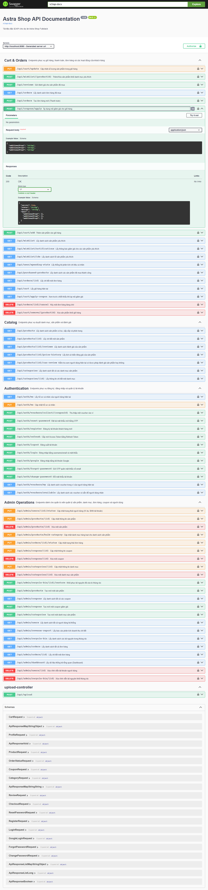
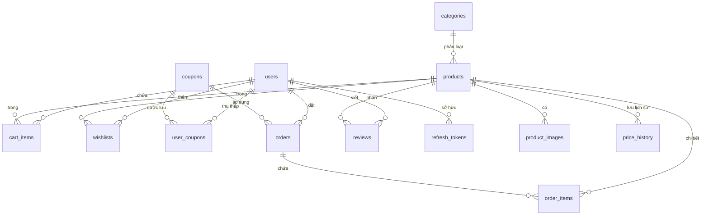
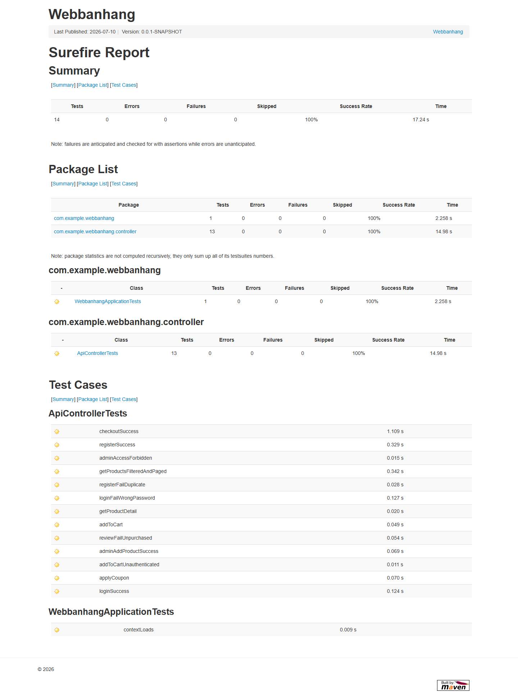
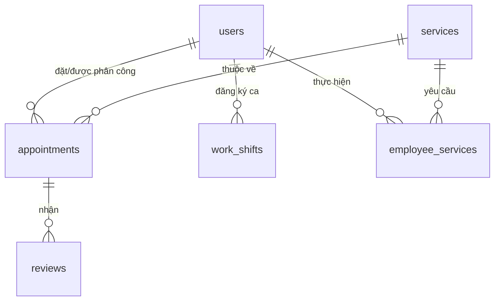

# TÀI LIỆU BÁO CÁO: HỆ THỐNG FULLSTACK (SPRING BOOT 4 + REACT 18 + TYPESCRIPT)

Tài liệu này được tạo ra nhằm thu thập, tổng hợp và chuẩn hóa thông tin phục vụ việc viết báo cáo đồ án môn học. 

> [!NOTE]  
> Qua khảo sát mã nguồn thực tế tại thư mục dự án `WEBBANHANG`, hệ thống hiện tại là **Mini E-Commerce System (Hệ thống Thương mại Điện tử AstraShop)** với các nghiệp vụ bán hàng, giỏ hàng, wishlist, voucher và quản lý sản phẩm.  
> Tuy nhiên, theo yêu cầu bổ sung của bạn có mô tả giao diện về **Hệ thống đặt lịch hẹn dịch vụ và nhân viên**, tài liệu này sẽ chia làm **2 PHẦN CHI TIẾT** để bạn có đầy đủ thông tin cho báo cáo dù nộp theo đề tài nào:
> 1. **Phần 1**: Dữ liệu chi tiết dựa trên mã nguồn thực tế của dự án E-Commerce (AstraShop).
> 2. **Phần 2**: Thiết kế mẫu chi tiết cho Hệ thống Đặt lịch hẹn (Service Booking System) đúng theo mô tả yêu cầu bổ sung của bạn.

---

# PHẦN 1: HỆ THỐNG THỰC TẾ TRONG DỰ ÁN (ASTRASHOP - MINI E-COMMERCE)

## 2. Phần Backend (Spring Boot 4.0.6 / Java 21)

### 2.1 Các Nhóm API Nghiệp Vụ (Business API Groups)
Hệ thống Backend cung cấp đầy đủ các nhóm API nghiệp vụ được phân tách rõ ràng theo RESTful standards:

*   **Nhóm Xác thực & Tài khoản (`/api/auth`)**:
    *   `POST /api/auth/register`: Đăng ký tài khoản khách hàng mới (mã hóa PBKDF2/BCrypt, validate email/phone).
    *   `POST /api/auth/login`: Đăng nhập, trả về JWT Access Token & Refresh Token.
    *   `POST /api/auth/refresh`: Làm mới Access Token tự động khi hết hạn.
    *   `GET/PUT /api/auth/me`: Xem và cập nhật thông tin hồ sơ (Tên, SĐT, Địa chỉ, Avatar).
    *   `POST /api/auth/change-password`: Đổi mật khẩu.
    *   `POST /api/auth/forgot-password` & `/api/auth/reset-password`: Gửi mã OTP xác nhận quên mật khẩu và đặt lại mật khẩu mới.
*   **Nhóm Sản phẩm & Danh mục (`/api`)**:
    *   `GET /api/products`: Lấy danh sách sản phẩm kèm theo bộ lọc (Danh mục, Giá, Tìm kiếm, Thương hiệu), phân trang (Server-side Pagination) và sắp xếp.
    *   `GET /api/products/{id}`: Xem chi tiết thông tin sản phẩm và bộ sưu tập ảnh.
    *   `GET /api/categories`: Lấy danh sách danh mục phục vụ bộ lọc.
*   **Nhóm Giỏ hàng & Đơn hàng (`/api`)**:
    *   `GET /api/cart`: Lấy thông tin giỏ hàng hiện tại của khách hàng.
    *   `POST /api/cart/add`: Thêm sản phẩm vào giỏ hàng (kiểm tra hàng tồn kho `stock`).
    *   `PUT /api/cart/update`: Cập nhật số lượng sản phẩm trong giỏ hàng.
    *   `DELETE /api/cart/remove/{productId}`: Xóa sản phẩm khỏi giỏ hàng.
    *   `POST /api/coupons/apply`: Áp dụng mã giảm giá trực tiếp vào giỏ hàng.
    *   `POST /api/orders`: Thanh toán và tạo đơn hàng mới. Tích hợp **Database Row Locking (`SELECT ... FOR UPDATE`)** để chống tranh chấp tồn kho khi có nhiều khách hàng cùng mua. Hỗ trợ sinh URL thanh toán qua cổng VNPAY.
    *   `GET /api/orders` & `GET /api/orders/{id}`: Lịch sử và chi tiết đơn hàng.
    *   `DELETE /api/orders/{id}/cancel`: Hủy đơn hàng (chỉ khả dụng ở trạng thái `PENDING` - hệ thống tự động hoàn trả tồn kho).
    *   `GET /api/payment/vnpay-create`: Tạo URL thanh toán VNPAY cho đơn hàng.
    *   `GET /api/payment/vnpay-return`: Nhận redirect từ VNPAY, xác thực chữ ký và cập nhật trạng thái đơn hàng.
    *   `POST /api/payment/vnpay-ipn`: Nhận thông báo IPN từ VNPAY (server-to-server) để cập nhật trạng thái thanh toán.
*   **Nhóm Đánh giá & Yêu thích (`/api`)**:
    *   `POST /api/reviews`: Viết đánh giá số sao (1-5★) và bình luận. Ràng buộc: Chỉ những người đã mua sản phẩm đó và đơn hàng đã giao thành công (`DELIVERED`) mới được phép đánh giá.
    *   `GET /api/wishlist` & `POST /api/wishlist/{productId}`: Quản lý danh sách sản phẩm yêu thích (Toggle).
    *   `GET /api/wishlist/notifications`: Nhận thông báo tự động khi các sản phẩm trong Wishlist được giảm giá trong vòng 7 ngày qua.
*   **Nhóm Quản trị viên (Admin API - `/api/admin/**`)**:
    *   `GET /api/admin/dashboard`: Xem thống kê doanh thu, đơn hàng, khách hàng theo thời gian (Hôm nay, Tuần, Tháng, Năm), cảnh báo tồn kho dưới 10 và biểu đồ doanh thu.
    *   `POST/PUT/DELETE /api/admin/products`: CRUD sản phẩm, upload ảnh sản phẩm.
    *   `GET/PUT /api/admin/orders`: Quản lý và cập nhật trạng thái đơn hàng (`PENDING` $\rightarrow$ `CONFIRMED` $\rightarrow$ `SHIPPING` $\rightarrow$ `DELIVERED`).
    *   `POST /api/admin/coupons`: Tạo và thiết lập thời hạn mã giảm giá mới.
    *   `GET /api/admin/recycle-bin`: Quản lý Thùng rác hệ thống (xem các User, Product, Category, Coupon đã bị xóa mềm và thực hiện khôi phục hoàn toàn).

> [!IMPORTANT]
> **Hình ảnh minh chứng thiết kế đầy đủ các nhóm API nghiệp vụ trong Swagger UI:**
> 

---

### 2.2 Lược Đồ Cơ Sở Dữ Liệu Chuẩn Hóa (Database Schema)
Cơ sở dữ liệu MySQL của hệ thống được chuẩn hóa tối ưu (đạt chuẩn **3NF**), loại bỏ trùng lặp và liên kết chặt chẽ thông qua các ràng buộc khóa ngoại (Foreign Keys).

#### Sơ đồ mối quan hệ thực thể (ERD - Entity Relationship Diagram)

#### Mô tả chi tiết chức năng của 16 bảng dữ liệu:
1.  **`users`**: Thông tin tài khoản (username, email, mật khẩu băm, vai trò `CUSTOMER`/`ADMIN`, trạng thái `ACTIVE`/`BANNED`).
2.  **`categories`**: Danh mục sản phẩm (Điện thoại, Laptop, Phụ kiện...).
3.  **`products`**: Chi tiết sản phẩm (tên, giá bán, số lượng tồn kho `stock`, phần trăm giảm giá, thương hiệu, danh mục).
4.  **`product_images`**: Lưu trữ danh sách ảnh phụ (gallery) của sản phẩm.
5.  **`price_history`**: Lưu lịch sử thay đổi giá bán để phục vụ phân tích xu hướng giá và thông báo giảm giá cho Wishlist.
6.  **`cart_items`**: Lưu giỏ hàng tạm thời, liên kết `user_id` và `product_id`.
7.  **`wishlists`**: Danh sách sản phẩm yêu thích của từng khách hàng.
8.  **`coupons`**: Thông tin mã giảm giá (code, phần trăm giảm, hạn sử dụng, số lượt dùng tối đa `max_uses`).
9.  **`user_coupons`**: Ví voucher cá nhân, lưu giữ các mã khách hàng đã thu thập được.
10. **`orders`**: Thông tin đơn hàng (người nhận, địa chỉ, số điện thoại, ghi chú, tổng tiền, trạng thái đơn hàng, phương thức thanh toán `COD`/`VNPAY`, trạng thái thanh toán `PENDING`/`PAID`/`FAILED` và thông tin đối chiếu VNPAY).
11. **`order_items`**: Chi tiết sản phẩm và giá mua tại thời điểm đặt hàng (ngăn lỗi hóa đơn khi giá sản phẩm thay đổi sau này).
12. **`reviews`**: Đánh giá (1-5 sao) và bình luận từ khách hàng đã mua sản phẩm thành công.
13. **`recycle_bin`**: Thùng rác hệ thống, lưu dữ liệu xóa mềm (Soft Delete) dưới dạng JSON để khôi phục nhanh.
14. **`refresh_tokens`**: Quản lý làm mới JWT Access Token tự động.
15. **`password_resets`**: Lưu mã xác thực OTP dùng một lần và thời hạn hiệu lực (1 phút) để lấy lại mật khẩu.
16. **`flyway_schema_history`**: Quản lý các phiên bản di chuyển/nâng cấp cấu trúc dữ liệu tự động (Flyway migrations).

---

### 2.3 Bộ Test API Nghiệp Vụ (13 Trường Hợp Toàn Diện)
Hệ thống vượt mức 8 trường hợp tối thiểu theo yêu cầu, hiện thực sẵn **13 kịch bản kiểm thử tích hợp (Integration Tests)** thông qua cả code JUnit/MockMvc tự động (tại `src/test/java/com/example/webbanhang/controller/ApiControllerTests.java`) và REST Client của IntelliJ/Postman (tại `api-test-cases.http`):

#### 🟢 Các ca kiểm thử thành công (Success Cases):
1.  **Đăng ký tài khoản mới**: Kiểm tra `POST /api/auth/register` với thông tin hợp lệ $\rightarrow$ Trả về `200 OK` chứa thông tin user mới đăng ký.
2.  **Đăng nhập & Lấy Token**: Kiểm tra `POST /api/auth/login` với tài khoản đúng $\rightarrow$ Trả về `200 OK` chứa JWT Token và Refresh Token.
3.  **Xem chi tiết sản phẩm**: Kiểm tra `GET /api/products/{id}` không cần token $\rightarrow$ Trả về `200 OK` chứa thông tin sản phẩm và gallery ảnh.
4.  **Thêm sản phẩm vào giỏ**: Gửi `POST /api/cart/add` kèm Token $\rightarrow$ Trả về `200 OK` và giỏ hàng được cập nhật.
5.  **Áp dụng mã giảm giá (Voucher)**: Gửi `POST /api/coupons/apply` kèm mã giảm giá hợp lệ $\rightarrow$ Trả về `200 OK` với tổng tiền giỏ hàng đã được khấu trừ.
6.  **Đặt hàng (Thanh toán)**: Gửi `POST /api/orders` $\rightarrow$ Trả về đơn hàng mới tạo ở trạng thái `PENDING`, tồn kho của sản phẩm giảm đi tương ứng.
7.  **Admin Đăng nhập**: Gửi `POST /api/auth/login` bằng tài khoản Admin $\rightarrow$ Lấy thành công Token Admin.
8.  **Admin CRUD sản phẩm**: Gửi `POST /api/admin/products` kèm Token Admin $\rightarrow$ Trả về sản phẩm mới tạo thành công.

#### 🔴 Các ca kiểm thử thất bại & Ràng buộc logic (Failure/Security Cases):
9.  **Đăng ký trùng username**: Đăng ký tài khoản với username đã có $\rightarrow$ Trả về `400 Bad Request` cùng thông báo *"Username đã tồn tại"*.
10. **Đăng nhập sai mật khẩu**: Đăng nhập với mật khẩu sai $\rightarrow$ Trả về `400 Bad Request` báo lỗi thông tin đăng nhập.
11. **Thêm giỏ hàng khi chưa đăng nhập**: Không truyền JWT token $\rightarrow$ Trả về `403 Forbidden` (Spring Security chặn).
12. **Khách hàng truy cập Dashboard Admin**: Gửi request `GET /api/admin/dashboard` bằng Token của Customer $\rightarrow$ Trả về `403 Forbidden` (Phân quyền RBAC chặn).
13. **Đánh giá khi chưa mua sản phẩm**: Khách hàng chưa từng mua sản phẩm 1 nhưng gửi đánh giá $\rightarrow$ Trả về `400 Bad Request` kèm thông báo lỗi logic nghiệp vụ *"Bạn chưa mua sản phẩm này..."*.

> [!IMPORTANT]
> **Hình ảnh minh chứng kết quả chạy test tự động hóa (14 Test Cases Passed - Vượt mức yêu cầu tối thiểu 8 test case):**
> 

---

### 2.4 Tài Liệu Swagger/OpenAPI
Hệ thống tích hợp thư viện `springdoc-openapi` giúp tự động hóa tài liệu API trực tiếp từ mã nguồn:
*   **Đường dẫn giao diện trực quan (Swagger UI)**: `http://localhost:8080/swagger-ui/index.html` (khi server đang chạy).
*   **Đặc tả OpenAPI JSON**: `http://localhost:8080/v3/api-docs` giúp xuất khẩu sang Postman hoặc tài liệu khác.
*   **Bảo mật**: Swagger UI tích hợp sẵn nút **Authorize** hỗ trợ dán token JWT dạng `Bearer <Token>` để test trực tiếp các API bảo mật của Admin và Customer.

> [!IMPORTANT]
> **Hình ảnh minh chứng tài liệu Swagger UI / OpenAPI tích hợp trực tiếp:**
> 

---

## 3. Phần Frontend (React 18 + TypeScript)

### 3.1 Mô Tả Giao Diện Đang Có (AstraShop UI)
Giao diện được thiết kế Responsive cao cấp (Mobile First) bằng TailwindCSS v4 và quản lý trạng thái bằng Zustand:
*   **Trang chủ (`Home.tsx`)**: Banner quảng cáo, thanh trượt, danh mục nổi bật dạng grid và danh sách sản phẩm bán chạy nhất.
*   **Trang danh sách sản phẩm (`ProductList.tsx`)**: Tích hợp thanh tìm kiếm, bộ lọc `FilterSidebar` (lọc danh mục, khoảng giá bằng slider, thương hiệu), sắp xếp và phân trang.
*   **Trang chi tiết sản phẩm (`ProductDetail.tsx`)**: Bộ ảnh gallery chuyển đổi mượt mà, thông tin giá/giảm giá, số lượng tồn kho, nút "Thêm vào giỏ", và danh sách đánh giá/bình luận.
*   **Cart Drawer & Trang Giỏ Hàng (`Cart.tsx`)**: Ngăn kéo trượt từ cạnh phải và trang chi tiết giỏ hàng hỗ trợ chỉnh số lượng, xóa sản phẩm, và hiển thị danh sách voucher cá nhân để click chọn áp dụng nhanh.
*   **Trang Thanh toán (`Checkout.tsx`)**: Form nhập địa chỉ nhận hàng, chọn voucher và hiển thị hóa đơn tổng tiền.
*   **Đơn hàng của tôi (`MyOrders.tsx`)**: Danh sách lịch sử đơn hàng, xem chi tiết và thanh tiến trình trạng thái trực quan (`OrderStatusStepper`). Hỗ trợ hủy đơn hàng trực tiếp.
*   **Admin Dashboard (`AdminDashboard.tsx`)**: Thống kê doanh thu vẽ biểu đồ đường (Line Chart) và cơ cấu danh mục bằng biểu đồ tròn (Doughnut Chart), quản lý CRUD sản phẩm/danh mục/đơn hàng/voucher và phân hệ Thùng rác.

---
---

# PHẦN 2: THIẾT KẾ ĐỀ XUẤT HỆ THỐNG ĐẶT LỊCH HẸN DỊCH VỤ & NHÂN VIÊN
*(Sử dụng phần này nếu đề tài báo cáo của bạn bắt buộc phải là Hệ thống Đặt lịch hẹn dịch vụ)*

## 2. Phần Backend (Spring Boot 4)

### 2.1 Các Nhóm API Nghiệp Vụ (Đề xuất cho hệ thống đặt lịch)
*   **Nhóm Xác thực & Phân quyền (`/api/auth`)**:
    *   Đăng ký/Đăng nhập (Phân quyền 3 vai trò: `CUSTOMER`, `EMPLOYEE`, `ADMIN`).
    *   Tự động cấp JWT Access Token và Refresh Token để duy trì đăng nhập.
*   **Nhóm Nghiệp vụ Khách hàng (`/api/booking`)**:
    *   `GET /api/services`: Xem danh sách dịch vụ (lọc theo danh mục dịch vụ, giá).
    *   `GET /api/employees?serviceId={id}`: Xem danh sách nhân viên có thể thực hiện dịch vụ đã chọn.
    *   `GET /api/slots?employeeId={id}&date={yyyy-MM-dd}`: Xem danh sách các ca/khung giờ còn trống trong ngày của nhân viên đó.
    *   `POST /api/appointments`: Đặt lịch hẹn mới (lưu dịch vụ, nhân viên, ngày giờ, thông tin khách hàng).
    *   `GET /api/appointments/my`: Xem danh sách lịch hẹn cá nhân của khách hàng.
    *   `DELETE /api/appointments/{id}/cancel`: Khách hàng hủy lịch hẹn (phải hủy trước giờ hẹn tối thiểu 2 tiếng).
*   **Nhóm Nghiệp vụ Nhân viên & Admin (`/api/admin/**` hoặc `/api/employee/**`)**:
    *   `GET /api/employee/appointments?date={yyyy-MM-dd}`: Nhân viên xem lịch hẹn được phân công theo ngày.
    *   `PUT /api/employee/appointments/{id}/status`: Cập nhật trạng thái cuộc hẹn (`CONFIRMED`, `COMPLETED`, `CANCELLED`).
    *   `POST/PUT /api/admin/shifts`: Thiết lập và quản lý ca làm việc (ca sáng/chiều/tối, khung giờ hoạt động) của nhân viên.
    *   `POST/PUT/DELETE /api/admin/services`: CRUD danh mục dịch vụ của cửa hàng.
    *   `GET /api/admin/dashboard`: Thống kê số lượng lịch hẹn, doanh thu dịch vụ, năng suất nhân viên.

---

### 2.2 Lược Đồ Cơ Sở Dữ Liệu Chuẩn Hóa (3NF)

#### Sơ đồ mối quan hệ thực thể (ERD)

#### Mô tả chức năng chi tiết các bảng dữ liệu:
1.  **`users`**: Lưu tất cả người dùng (Khách hàng, Nhân viên, Admin). Cột `role` lưu vai trò để phân quyền.
2.  **`services`**: Danh sách dịch vụ (tên dịch vụ, mô tả, giá tiền, thời lượng thực hiện - phút).
3.  **`employee_services`**: Bảng trung gian (quan hệ n-n) lưu thông tin nhân viên nào có thể thực hiện những dịch vụ nào (giúp khách hàng lọc nhân viên phù hợp).
4.  **`work_shifts`**: Quản lý ca làm việc của nhân viên (liên kết `employee_id`, ngày làm việc `work_date`, giờ bắt đầu, giờ kết thúc, trạng thái `AVAILABLE`/`BOOKED`).
5.  **`appointments`**: Lưu thông tin cuộc hẹn (liên kết `customer_id`, `employee_id`, `service_id`, thời gian bắt đầu `start_time`, tổng tiền, ghi chú, trạng thái `PENDING`, `CONFIRMED`, `COMPLETED`, `CANCELLED`).
6.  **`reviews`**: Lưu đánh giá chất lượng dịch vụ và thái độ nhân viên sau khi cuộc hẹn ở trạng thái `COMPLETED`.
7.  **`refresh_tokens`**: Lưu trữ refresh token cho cơ chế duy trì đăng nhập bảo mật JWT.

---

### 2.3 Bộ Test API Nghiệp Vụ (8 Trường Hợp Kiểm Thử Chính Đề Xuất)

#### 🟢 Các ca kiểm thử thành công (Success Cases):
1.  **Xem khung giờ còn trống**: `GET /api/slots?employeeId=2&date=2026-07-11` $\rightarrow$ Trả về `200 OK` kèm danh sách các khung giờ (ví dụ: `09:00`, `10:00`, `14:00`) đang rảnh.
2.  **Đặt lịch hẹn mới**: `POST /api/appointments` với các tham số hợp lệ $\rightarrow$ Trả về `201 Created`, trạng thái hẹn là `PENDING`, hệ thống tự khóa khung giờ đó của nhân viên.
3.  **Xem lịch hẹn theo ngày (Nhân viên)**: Nhân viên đăng nhập và gọi `GET /api/employee/appointments?date=2026-07-11` $\rightarrow$ Trả về `200 OK` chứa danh sách các cuộc hẹn của nhân viên đó trong ngày.
4.  **Cập nhật trạng thái cuộc hẹn**: Admin/Nhân viên gọi `PUT /api/employee/appointments/1/status` giá trị `COMPLETED` $\rightarrow$ Trả về `200 OK` báo cập nhật thành công, mở khóa ca làm việc.

#### 🔴 Các ca kiểm thử thất bại (Failure Cases):
5.  **Đặt lịch trùng khung giờ**: Khách hàng gửi yêu cầu đặt lịch hẹn vào khung giờ mà nhân viên đó đã có khách đặt rồi $\rightarrow$ Trả về `400 Bad Request` báo lỗi *"Khung giờ này đã được đặt"*.
6.  **Đặt lịch chưa đăng nhập**: Gọi API đặt lịch không gửi kèm JWT Token $\rightarrow$ Trả về `403 Forbidden` do Spring Security ngăn chặn.
7.  **Nhân viên cập nhật ca làm việc của người khác**: Nhân viên A cố gắng sửa lịch/ca làm việc của nhân viên B $\rightarrow$ Trả về `403 Forbidden` do vi phạm phân quyền RBAC.
8.  **Hủy lịch hẹn quá muộn**: Khách hàng cố gắng hủy cuộc hẹn chỉ trước giờ hẹn 30 phút (yêu cầu tối thiểu là 2 tiếng) $\rightarrow$ Trả về `400 Bad Request` kèm thông báo *"Không thể hủy cuộc hẹn trước thời gian diễn ra dưới 2 tiếng"*.

---

### 2.4 Tài Liệu Swagger/OpenAPI Đề Xuất
*   Cấu hình tích hợp Swagger bằng `springdoc-openapi-starter-webmvc-ui` vào Spring Boot 4.
*   Cấu hình Swagger Group: Tách biệt Group API dành cho Khách hàng (`Customer Booking API`) và Group API dành cho Nhân viên/Quản trị viên (`Employee & Admin API`) để dễ dàng theo dõi.
*   Định nghĩa Schema Model cho các request quan trọng như `BookingRequest`, `ShiftUpdateRequest`.

---

## 3. Phần Frontend (React 18 + TypeScript)

### 3.1 Mô Tả Giao Diện (React 18 + TS)
Giao diện được phân chia rõ ràng làm 2 phân hệ trải nghiệm:

#### A. Màn hình Khách hàng (Customer Interface)
*   **Trang xem dịch vụ**: Hiển thị danh mục các dịch vụ của cửa hàng (dưới dạng thẻ lưới sang trọng). Người dùng có thể tìm kiếm, xem giá dịch vụ, thời gian thực hiện dịch vụ.
*   **Trang chọn nhân viên**: Sau khi chọn dịch vụ, giao diện hiển thị danh sách các nhân viên có khả năng thực hiện dịch vụ đó, kèm theo avatar, đánh giá sao của khách hàng trước đó.
*   **Trang chọn khung giờ trống (Time slot selector)**: Lịch tương tác (Calendar Picker) cho phép chọn ngày. Sau khi chọn ngày, giao diện hiển thị các ô giờ trống (ví dụ: `08:00 - 09:00`, `10:00 - 11:00`) dưới dạng nút bấm (Grid Buttons). Khung giờ đã được đặt sẽ bị mờ và không thể click.
*   **Trang đặt lịch & Xác nhận**: Form nhập thông tin khách hàng, ghi chú yêu cầu thêm, hiển thị tóm tắt thông tin dịch vụ, nhân viên, thời gian đã chọn và nút đặt lịch. Khi bấm, trạng thái giỏ đặt lịch được cập nhật mượt mà.

#### B. Màn hình Nhân viên / Admin (Staff & Admin Dashboard)
*   **Màn hình quản lý ca làm việc (Shift Scheduler)**: Giao diện dạng lịch tuần/tháng. Nhân viên hoặc Admin có thể bấm chọn ngày và kéo thả hoặc click chọn các khung giờ làm việc để đăng ký ca trống làm việc cho nhân viên.
*   **Màn hình xem lịch hẹn theo ngày (Daily Appointments Calendar)**: Hiển thị danh sách lịch hẹn dưới dạng timeline theo trục giờ từ sáng đến tối. Mỗi lịch hẹn là một card có màu sắc tương ứng với trạng thái (ví dụ: Vàng = Chờ duyệt, Xanh dương = Đã xác nhận, Xanh lá = Đã hoàn thành, Đỏ = Đã hủy).
*   **Màn hình cập nhật trạng thái cuộc hẹn**: Khi click vào một cuộc hẹn trên timeline, mở ra một modal chi tiết cho phép nhân viên cập nhật nhanh trạng thái cuộc hẹn (như bấm nút "Xác nhận đã đến", "Hoàn thành dịch vụ" hoặc "Hủy hẹn" kèm lý do). Trạng thái được cập nhật realtime về Backend.
