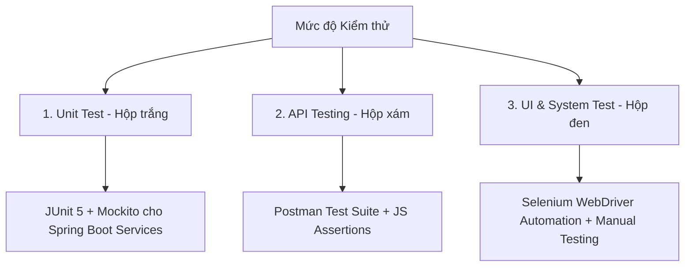

# 📋 KẾ HOẠCH KIỂM THỬ TỔNG THỂ (MASTER TEST PLAN)
**Dự án:** AstraShop - Hệ thống Thương mại Điện tử Mini (Mini E-Commerce System)  
**Phiên bản:** 1.0  
**Tác giả:** Tester / QA Engineer  
**Ngày lập:** 23/07/2026  

---

## 1. GIỚI THIỆU & MỤC TIÊU (INTRODUCTION & OBJECTIVES)
Tài liệu Kế hoạch Kiểm thử này xác định chiến lược, phạm vi, môi trường, nguồn lực và lịch trình kiểm thử cho hệ thống thương mại điện tử **AstraShop** (Fullstack Java Spring Boot + React TypeScript).

### Mục tiêu chất lượng (Quality Goals):
- **Tính đúng đắn về chức năng (Functional Correctness):** Đảm bảo 100% các luồng nghiệp vụ mua hàng, giỏ hàng, thanh toán VNPAY/COD, áp mã giảm giá và quản trị vận hành chính xác theo yêu cầu.
- **Tính toàn vẹn dữ liệu (Data Integrity):** Ngăn chặn lỗi tranh chấp hàng tồn kho (Race condition) khi nhiều khách hàng cùng mua một mặt hàng bằng cơ chế Database Row Locking (`SELECT ... FOR UPDATE`).
- **Tính an toàn & bảo mật (Security):** Kiểm tra cơ chế phân quyền (RBAC - Customer vs Admin), bảo mật API bằng JWT Bearer Token, băm mật khẩu BCrypt.
- **Độ tin cậy của API (API Reliability):** Đảm bảo tất cả các endpoint API trả về đúng HTTP Status Code và định dạng JSON chuẩn.

---

## 2. PHẠM VI KIỂM THỬ (TEST SCOPE)

### 2.1 Trong phạm vi (In-Scope)
| Phân hệ (Module) | Các tính năng chi tiết cần kiểm thử |
| :--- | :--- |
| **Xác thực người dùng (Auth)** | Đăng ký tài khoản, Đăng nhập (JWT), Google OAuth2 Login, Quên mật khẩu qua OTP 6 số, Đổi mật khẩu. |
| **Danh mục & Sản phẩm** | Tìm kiếm sản phẩm, Lọc đa tiêu chí (danh mục, khoảng giá, rating), Phân trang, Xem chi tiết sản phẩm & album ảnh gallery. |
| **Yêu thích (Wishlist)** | Thêm/Xóa wishlist, Nhận thông báo tự động khi sản phẩm wishlist giảm giá trong 7 ngày. |
| **Giỏ hàng & Coupon** | Thêm/Xóa/Sửa số lượng trong giỏ hàng, Thu thập voucher từ trang `/vouchers`, Áp mã giảm giá tự động hoặc chọn từ ví. |
| **Thanh toán & Đơn hàng** | Checkout đơn hàng (COD và VNPAY Sandbox), Kiểm tra trừ tồn kho an toàn, Theo dõi trạng thái đơn hàng Stepper (`PENDING` -> `DELIVERED`), Tự hủy đơn `PENDING`. |
| **Đánh giá & Review** | Viết đánh giá 1-5 sao và bình luận (chỉ cho phép khách hàng đã mua sản phẩm đó và đơn hàng `DELIVERED`). |
| **Quản trị viên (Admin)** | Dashboard thống kê doanh thu/tồn kho, CRUD Sản phẩm & Upload ảnh, CRUD Danh mục, CRUD Coupon, Quản lý trạng thái Đơn hàng, Thùng rác (Recycle Bin - Restore / Hard Delete). |

### 2.2 Ngoài phạm vi (Out-of-Scope)
- Kiểm thử hiệu năng tải cực lớn (Stress/Load Testing trên 100,000 CCU).
- Cổng thanh toán quốc tế thực tế (Stripe, Paypal) - chỉ sử dụng VNPAY Sandbox thử nghiệm.

---

## 3. CHIẾN LƯỢC KIỂM THỬ (TEST STRATEGY & APPROACH)

Hệ thống áp dụng phương pháp kiểm thử toàn diện **3 cấp độ**:

### 3.1 Kiểm thử Hộp trắng (White-box Testing / Unit Testing)
- **Công cụ:** JUnit 5, Mockito.
- **Đối tượng:** Các phương thức xử lý logic nghiệp vụ tại tầng Service (`AuthService`, `ShopService`).
- **Tiêu chí:** Đạt code coverage cao đối với các hàm tính toán tiền, áp mã giảm giá, kiểm tra tồn kho.

### 3.2 Kiểm thử Hộp xám (Gray-box Testing / API Testing)
- **Công cụ:** Postman, REST Client (`api-test-cases.http`), Spring Boot `MockMvc`.
- **Nội dung:** Kiểm tra response status code (`200 OK`, `400 Bad Request`, `401 Unauthorized`, `403 Forbidden`), cấu trúc body JSON, và thời gian phản hồi API.

### 3.3 Kiểm thử Hộp đen (Black-box Testing / System & UI Testing)
- **Công cụ:** Selenium WebDriver, Chạy kiểm thử thủ công (Manual Testing).
- **Kỹ thuật thiết kế Test Case:**
  - **Phân vùng tương đương (Equivalence Partitioning):** Phân chia dữ liệu đầu vào hợp lệ và không hợp lệ (ví dụ: Tồn kho <= 0, giá tiền < 0, số điện thoại đúng/sai định dạng).
  - **Phân tích giá trị biên (Boundary Value Analysis):** Kiểm thử tại các mốc biên (ví dụ: Số lượng đặt mua = 1, = Tồn kho tối đa, = Tồn kho + 1).

---

## 4. MÔI TRƯỜNG KIỂM THỬ (TEST ENVIRONMENT)

| Thành phần | Cấu hình / Thông số |
| :--- | :--- |
| **Hệ điều hành** | Windows 11 / Linux |
| **Backend Runtime** | Java OpenJDK 21, Spring Boot 4.0.6 |
| **Database** | MySQL Server 8.0 (Database: `webbanhang`, Port: 3306) |
| **Frontend Runtime** | Node.js v18+, React 19, Vite Dev Server (Port: 3000) |
| **Cổng thanh toán thử nghiệm** | VNPAY Sandbox Environment (Thẻ NCB Test) |
| **Trình duyệt kiểm thử** | Google Chrome Version 120+ |

---

## 5. TIÊU CHÍ DỪNG & CHUYỂN GIAO (ENTRY / EXIT CRITERIA)

### 5.1 Tiêu chí bắt đầu (Entry Criteria)
- Mã nguồn Backend và Frontend đã được biên dịch thành công không có lỗi syntax (`BUILD SUCCESS`).
- Cơ sở dữ liệu MySQL đã được nạp dữ liệu mẫu (Seed Data) thông qua các migration script của Flyway (`V1__init_schema.sql` đến `V12`).

### 5.2 Tiêu chí hoàn thành (Exit Criteria)
- **Unit Test Backend:** 100% các test case trong JUnit/Mockito vượt qua (`Tests run: PASSED`).
- **API Automation Test:** 100% các request trong Postman Collection trả về phản hồi hợp lệ với các assertions passed.
- **UI Automation Test:** Các kịch bản Selenium kết thúc thành công không bị gián đoạn hoặc gặp lỗi uncaught exception.
- Không còn bất kỳ lỗi mức độ **Critical** hoặc **High** nào còn tồn đọng chưa được khắc phục.

---

## 6. QUẢN LÝ LỖI (DEFECT MANAGEMENT PROCESS)

Các lỗi phát hiện trong quá trình kiểm thử được ghi nhận vào **Defect Log** theo mẫu quy chuẩn MantisBT / Jira bao gồm các trường:
- **Bug ID & Title:** Mã định danh và tiêu đề ngắn gọn về lỗi.
- **Module:** Phân hệ phát sinh lỗi.
- **Severity (Mức độ nghiêm trọng):** Critical / High / Medium / Low.
- **Priority (Độ ưu tiên xử lý):** P1 (Khẩn cấp) -> P4 (Thấp).
- **Steps to Reproduce:** Các bước chi tiết để tái hiện lỗi.
- **Expected Result vs Actual Result:** Kết quả mong đợi đối chiếu với kết quả thực tế.
