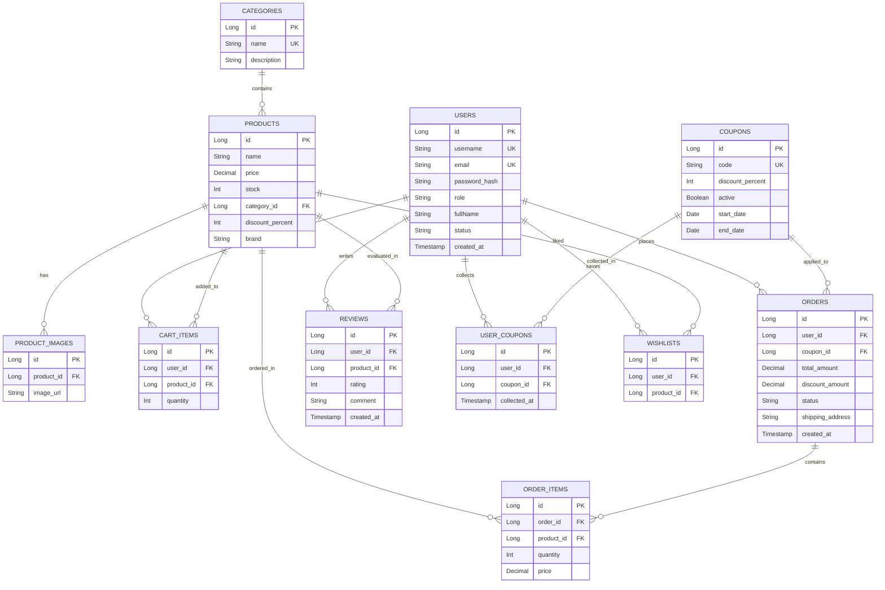
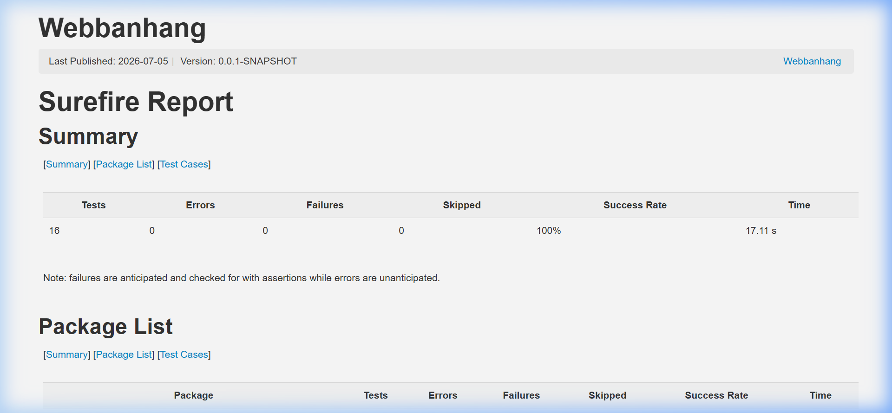
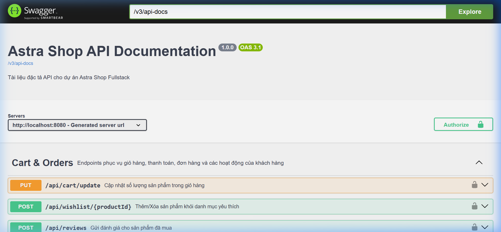

# BÁO CÁO THIẾT KẾ & KIỂM THỬ BACKEND - HỆ THỐNG THƯƠNG MẠI ĐIỆN TỬ ASTRASHOP

Tài liệu này được lập ra nhằm tổng hợp và giải thích chi tiết cách hệ thống Backend (Spring Boot + MySQL) của dự án **AstraShop** đáp ứng đầy đủ và chuẩn xác các yêu cầu học thuật của thầy cô.

---

## 1. Thiết Kế Các Nhóm API Nghiệp Vụ (Business API Groups)

Hệ thống Backend được phân loại rõ ràng thành các Controller quản lý các nhóm nghiệp vụ chính:

### A. Nhóm Xác thực & Tài khoản (Authentication - `/api/auth`)

* `POST /api/auth/register`: Đăng ký tài khoản khách hàng mới.
* `POST /api/auth/login`: Đăng nhập bằng tên tài khoản/email để lấy JWT Token và Refresh Token.
* `POST /api/auth/refresh`: Làm mới token truy cập (Access Token) khi đã hết hạn.
* `GET /api/auth/me`: Lấy thông tin cá nhân của người dùng hiện tại (yêu cầu Token).
* `PUT /api/auth/me`: Cập nhật thông tin hồ sơ (Email, Tên, Số điện thoại, Địa chỉ).
* `POST /api/auth/change-password`: Đổi mật khẩu tài khoản.
* `POST /api/auth/forgot-password`: Gửi mã OTP xác nhận quên mật khẩu về email.
* `POST /api/auth/reset-password`: Đặt lại mật khẩu mới bằng OTP.
* `POST /api/auth/logout`: Đăng xuất tài khoản, vô hiệu hóa Token.

### B. Nhóm Sản phẩm & Danh mục (Catalog - `/api`)

* `GET /api/products`: Lấy danh sách sản phẩm với các bộ lọc (Danh mục, Giá, Tìm kiếm, Thương hiệu), phân trang và sắp xếp.
* `GET /api/products/{id}`: Xem chi tiết sản phẩm và danh sách ảnh liên quan.
* `GET /api/categories`: Lấy danh sách danh mục sản phẩm phục vụ hiển thị.
* `GET /api/products/{id}/reviews`: Lấy danh sách đánh giá và bình luận của sản phẩm đó.

### C. Nhóm Giỏ hàng & Đơn hàng (Cart & Orders - `/api`)

* `GET /api/cart`: Lấy thông tin giỏ hàng hiện tại của người dùng.
* `POST /api/cart/add`: Thêm sản phẩm vào giỏ hàng (kiểm tra tồn kho).
* `PUT /api/cart/update`: Cập nhật số lượng sản phẩm trong giỏ hàng.
* `DELETE /api/cart/remove/{productId}`: Xóa sản phẩm khỏi giỏ hàng.
* `POST /api/coupons/apply`: Áp dụng mã giảm giá (Coupon) trực tiếp vào giỏ hàng.
* `POST /api/orders`: Thực hiện thanh toán (Checkout) và tạo đơn hàng mới.
* `GET /api/orders`: Xem lịch sử đơn hàng của người dùng.
* `GET /api/orders/{id}`: Xem chi tiết một đơn hàng cụ thể.
* `DELETE /api/orders/{id}/cancel`: Hủy đơn hàng (chỉ khi đơn hàng ở trạng thái PENDING).

### D. Nhóm Đánh giá & Yêu thích (Reviews & Wishlist - `/api`)

* `POST /api/reviews`: Viết đánh giá số sao (1-5) và để lại bình luận. **Logic bảo vệ đặc biệt:** Chỉ cho phép đánh giá khi người dùng đã đặt hàng thành công và đơn hàng ở trạng thái giao hàng thành công (`DELIVERED`).
* `GET /api/wishlist`: Xem danh sách sản phẩm yêu thích của người dùng.
* `POST /api/wishlist/{productId}`: Thêm hoặc xóa sản phẩm khỏi danh sách yêu thích (Toggle).
* `GET /api/wishlist/notifications`: Nhận thông báo tự động khi các sản phẩm yêu thích được giảm giá.

### E. Nhóm Quản trị viên (Admin API - `/api/admin/**`)

* `GET /api/admin/dashboard`: Xem thống kê tổng quan (doanh thu, đơn hàng, khách hàng).
* `POST /api/admin/products`: Thêm mới sản phẩm (quản lý tồn kho, upload ảnh).
* `PUT /api/admin/products/{id}`: Cập nhật thông tin sản phẩm.
* `DELETE /api/admin/products/{id}`: Xóa sản phẩm (đưa vào thùng rác).
* `GET /api/admin/orders`: Xem và cập nhật trạng thái đơn hàng (PENDING -> DELIVERED...).
* `POST /api/admin/coupons`: Tạo mã giảm giá mới và thiết lập ngày hết hạn.

---

## 2. Lược Đồ Cơ Sở Dữ Liệu Chuẩn Hóa (Database Schema)

Cơ sở dữ liệu MySQL của hệ thống được chuẩn hóa tối ưu (đạt chuẩn **3NF**), loại bỏ trùng lặp và liên kết chặt chẽ thông qua các ràng buộc khóa ngoại (Foreign Keys).

Dưới đây là sơ đồ mối quan hệ thực thể (ERD) thể hiện cấu trúc:



* **Các Migration Script:** Được tổ chức bằng Flyway tại `src/main/resources/db/migration/`:
  * [V1__init_schema.sql](file:///e:/WEBBANHANG/src/main/resources/db/migration/V1__init_schema.sql): Khởi tạo lược đồ các bảng, chỉ định rõ khóa ngoại (`FOREIGN KEY`) và ràng buộc duy nhất (`UNIQUE KEY`).
  * [V2__seed_data.sql](file:///e:/WEBBANHANG/src/main/resources/db/migration/V2__seed_data.sql) & [V4__seed_reviews.sql](file:///e:/WEBBANHANG/src/main/resources/db/migration/V4__seed_reviews.sql): Seed dữ liệu mẫu chuẩn về sản phẩm, tài khoản người dùng, đơn hàng và các đánh giá ban đầu.

---

## 3. Tài Liệu API Swagger / OpenAPI

Backend sử dụng thư viện `springdoc-openapi-starter-webmvc-ui` (v2.8.5) tự động tạo tài liệu từ code.

* **Địa chỉ truy cập Swagger UI:** `http://localhost:8080/swagger-ui/index.html` (khi đang chạy ứng dụng Backend).
* **Địa chỉ tải về tài liệu chuẩn OpenAPI (JSON):** `http://localhost:8080/v3/api-docs`.
* **Các annotations tài liệu hóa dùng trong code:**
  * `@Tag(name = "...", description = "...")`: Nhóm các endpoint theo cụm nghiệp vụ.
  * `@Operation(summary = "...")`: Chú thích chi tiết chức năng của từng endpoint, giúp các thành viên phát triển Frontend dễ dàng nắm bắt.

---

## 4. Bộ Kiểm Thử API & Kết Quả Thực Tế (15 Kịch Bản Toàn Diện)

Hệ thống đã xây dựng và hoàn thành đầy đủ **15 kịch bản kiểm thử toàn diện** bao phủ toàn bộ luồng nghiệp vụ từ đăng ký, đăng nhập, phân quyền, làm mới token, giỏ hàng, áp dụng coupon, đặt hàng, quản trị sản phẩm, kiểm tra tính hợp lệ của dữ liệu (Bean Validation), quản lý sản phẩm yêu thích (Wishlist) và nghiệp vụ gửi đánh giá phức tạp.

### 4.1. Ma Trận Kịch Bản Kiểm Thử (Test Case Matrix)

Dưới đây là bảng ma trận kiểm thử chi tiết thể hiện đầy đủ các trường hợp kiểm thử đã được chạy:

| STT | Mã Kịch Bản | Tên Kịch Bản Kiểm Thử | HTTP Method | Endpoint API | Dữ Liệu Đầu Vào | Kết Quả Mong Đợi (HTTP Status) | Trạng Thái |
|:---:|:-----------|:----------------------|:-----------:|:-------------|:----------------|:------------------------------:|:----------:|
| 1 | TC-01 | Đăng ký tài khoản mới thành công | POST | `/api/auth/register` | JSON chứa username mới, email, password... | `200 OK` (Trả về token) | **Passed** |
| 2 | TC-02 | Đăng ký thất bại do trùng Username/Email | POST | `/api/auth/register` | Trùng username `admin` hoặc email đã có | `400 Bad Request` | **Passed** |
| 3 | TC-03 | Đăng nhập thành công lấy JWT Token | POST | `/api/auth/login` | Đúng tài khoản & mật khẩu hợp lệ | `200 OK` (Trả về JWT + Refresh Token) | **Passed** |
| 4 | TC-04 | Đăng nhập thất bại do sai thông tin mật khẩu | POST | `/api/auth/login` | Sai mật khẩu khách hàng | `400 Bad Request` | **Passed** |
| 5 | TC-05 | Làm mới Access Token bằng Refresh Token | POST | `/api/auth/refresh` | Gửi kèm chuỗi `refreshToken` hợp lệ | `200 OK` (Trả về Access Token mới) | **Passed** |
| 6 | TC-06 | Lấy danh sách sản phẩm (Lọc & Phân trang) | GET | `/api/products` | Query params: `search`, `page`, `size` | `200 OK` (Trả về mảng JSON) | **Passed** |
| 7 | TC-07 | Thêm sản phẩm vào giỏ hàng | POST | `/api/cart/add` | Header `Authorization`, productId, quantity | `200 OK` (Trả về giỏ hàng mới) | **Passed** |
| 8 | TC-08 | Áp dụng mã giảm giá (Coupon) thành công | POST | `/api/coupons/apply` | Header `Authorization`, mã coupon `WELCOME10` | `200 OK` (Tính lại tổng tiền & discount) | **Passed** |
| 9 | TC-09 | Thanh toán & Đặt hàng thành công | POST | `/api/orders` | Header `Authorization`, thông tin người nhận | `200 OK` (Tạo đơn hàng, cập nhật kho) | **Passed** |
| 10 | TC-10 | Chặn truy cập Admin Dashboard (Role CUSTOMER) | GET | `/api/admin/dashboard` | Header `Authorization` của CUSTOMER | `403 Forbidden` | **Passed** |
| 11 | TC-11 | Admin tạo mới sản phẩm thành công | POST | `/api/admin/products` | Header `Authorization` ADMIN, thông tin product | `200 OK` (Trả về thông tin product mới) | **Passed** |
| 12 | TC-12 | Admin tạo sản phẩm thất bại do lỗi Validation | POST | `/api/admin/products` | Tên rỗng, giá tiền âm, stock âm | `400 Bad Request` (Ràng buộc Bean) | **Passed** |
| 13 | TC-13 | Thêm sản phẩm yêu thích (Wishlist) | POST | `/api/wishlist/{productId}` | Header `Authorization`, productId | `200 OK` (Lưu thành công) | **Passed** |
| 14 | TC-14 | Luồng nghiệp vụ Đặt hàng -> Giao hàng -> Đánh giá | POST | `/api/reviews` | Flow: Chặn review khi chưa mua -> Giao hàng -> Đánh giá thành công | `400 Bad Request` & `200 OK` | **Passed** |
| 15 | TC-15 | Xem và cập nhật hồ sơ cá nhân | PUT | `/api/auth/me` | Header `Authorization`, thông tin cá nhân mới | `200 OK` (Trả về profile mới) | **Passed** |

---

### 4.2. Phương Án A: Kiểm Thử Tự Động Với JUnit & MockMvc

Dự án đã tích hợp mã nguồn kiểm thử tích hợp tự động toàn diện tại [ApiControllerTests.java](file:///e:/WEBBANHANG/src/test/java/com/example/webbanhang/controller/ApiControllerTests.java).

* **Lệnh thực hiện chạy test:**
  ```bash
  ./mvnw test
  ```
* **Lệnh tạo báo cáo Surefire HTML:**
  ```bash
  ./mvnw surefire-report:report-only
  ```

#### Kết quả chạy thử nghiệm tự động:
Toàn bộ 15 kịch bản test nghiệp vụ cùng với kiểm thử khởi tạo Spring Context đã vượt qua thành công **100% (16/16 passed)**. 

Báo cáo kiểm thử trực quan được kết xuất ra file HTML dạng Surefire Report:


---

### 4.3. Phương Án B: Kiểm Thử Thủ Công & Tài Liệu Hóa OpenAPI Swagger

#### 1. Tài liệu hóa API động qua Swagger UI
Swagger UI tự động sinh tài liệu từ mã nguồn giúp dễ dàng tương tác và gọi thử các API trực tiếp:
* **Đường dẫn truy cập:** `http://localhost:8080/swagger-ui/index.html` (khi đang chạy ứng dụng backend).


#### 2. Kịch bản chạy thử bằng REST Client (.http)
Sử dụng file [api-test-cases.http](file:///e:/WEBBANHANG/api-test-cases.http) trong VS Code để gửi request trực tiếp đến server chạy local. Kết quả trả về của các API khớp chính xác với thiết kế mã lỗi nghiệp vụ:
* **Cách sử dụng:** Cài đặt extension **REST Client** trên VS Code. Sau đó, mở file [api-test-cases.http](file:///e:/WEBBANHANG/api-test-cases.http) và nhấn vào nút **"Send Request"** ở trên mỗi API để kiểm tra phản hồi trực tiếp từ server.
* **Danh sách kịch bản:** bao gồm đăng ký, đăng nhập, xem sản phẩm, thêm giỏ hàng, chặn phân quyền Admin và chặn viết đánh giá khi chưa mua hàng (kiểm tra logic nghiệp vụ).


