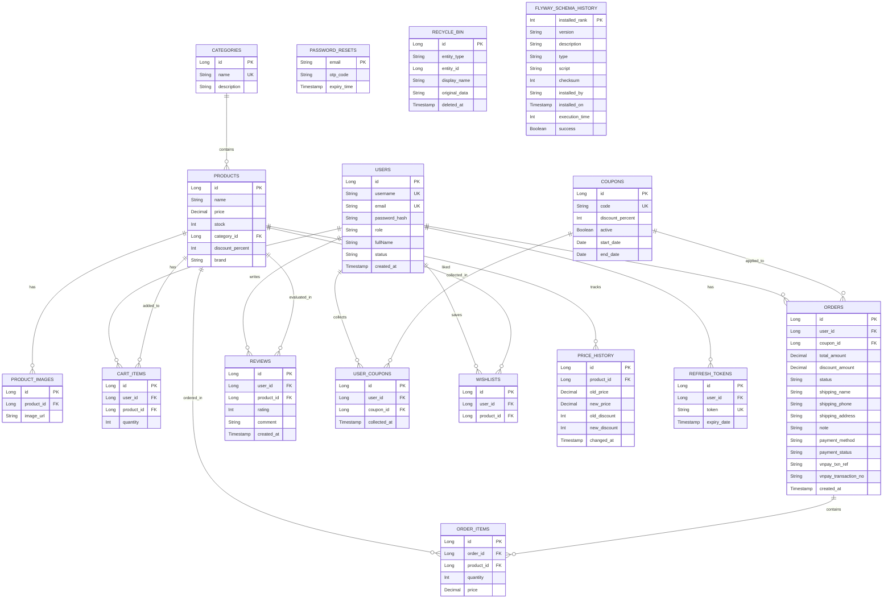

# BÁO CÁO THIẾT KẾ & KIỂM THỬ BACKEND - HỆ THỐNG THƯƠNG MẠI ĐIỆN TỬ ASTRASHOP

Tài liệu này được lập ra nhằm tổng hợp và giải thích chi tiết cách hệ thống Backend (Spring Boot + MySQL) của dự án **AstraShop** đáp ứng đầy đủ và chuẩn xác các yêu cầu học thuật của thầy cô.

---

## 1. Thiết Kế Các Nhóm API Nghiệp Vụ (Business API Groups)

Hệ thống Backend được phân loại rõ ràng thành các Controller quản lý các nhóm nghiệp vụ chính:

### A. Nhóm Xác thực & Tài khoản (Authentication - `/api/auth`)

* `POST /api/auth/register`: Đăng ký tài khoản khách hàng mới.
* `POST /api/auth/login`: Đăng nhập bằng tên tài khoản/email để lấy JWT Token và Refresh Token.
* `POST /api/auth/refresh`: Làm mới token truy cập (Access Token) khi đã hết hạn.
* `GET /api/auth/me`: Lấy thông tin cá nhân của người dùng hiện tại (yêu cầu Token).
* `PUT /api/auth/me`: Cập nhật thông tin hồ sơ (Email, Tên, Số điện thoại, Địa chỉ).
* `POST /api/auth/change-password`: Đổi mật khẩu tài khoản.
* `POST /api/auth/forgot-password`: Gửi mã OTP xác nhận quên mật khẩu về email.
* `POST /api/auth/reset-password`: Đặt lại mật khẩu mới bằng OTP.
* `POST /api/auth/logout`: Đăng xuất tài khoản, vô hiệu hóa Token.

### B. Nhóm Sản phẩm & Danh mục (Catalog - `/api`)

* `GET /api/products`: Lấy danh sách sản phẩm với các bộ lọc (Danh mục, Giá, Tìm kiếm, Thương hiệu), phân trang và sắp xếp.
* `GET /api/products/{id}`: Xem chi tiết sản phẩm và danh sách ảnh liên quan.
* `GET /api/categories`: Lấy danh sách danh mục sản phẩm phục vụ hiển thị.
* `GET /api/products/{id}/reviews`: Lấy danh sách đánh giá và bình luận của sản phẩm đó.

### C. Nhóm Giỏ hàng & Đơn hàng (Cart & Orders - `/api`)

* `GET /api/cart`: Lấy thông tin giỏ hàng hiện tại của người dùng.
* `POST /api/cart/add`: Thêm sản phẩm vào giỏ hàng (kiểm tra tồn kho).
* `PUT /api/cart/update`: Cập nhật số lượng sản phẩm trong giỏ hàng.
* `DELETE /api/cart/remove/{productId}`: Xóa sản phẩm khỏi giỏ hàng.
* `POST /api/coupons/apply`: Áp dụng mã giảm giá (Coupon) trực tiếp vào giỏ hàng.
* `POST /api/orders`: Thực hiện thanh toán (Checkout) và tạo đơn hàng mới.
* `GET /api/orders`: Xem lịch sử đơn hàng của người dùng.
* `GET /api/orders/{id}`: Xem chi tiết một đơn hàng cụ thể.
* `DELETE /api/orders/{id}/cancel`: Hủy đơn hàng (chỉ khi đơn hàng ở trạng thái PENDING).
* `GET /api/payment/vnpay-create`: Tạo URL thanh toán VNPAY cho đơn hàng.
* `GET /api/payment/vnpay-return`: Nhận redirect từ VNPAY, xác thực chữ ký và cập nhật trạng thái đơn hàng.
* `POST /api/payment/vnpay-ipn`: Nhận thông báo IPN từ VNPAY (server-to-server) để cập nhật trạng thái thanh toán.

### D. Nhóm Đánh giá & Yêu thích (Reviews & Wishlist - `/api`)

* `POST /api/reviews`: Viết đánh giá số sao (1-5) và để lại bình luận. **Logic bảo vệ đặc biệt:** Chỉ cho phép đánh giá khi người dùng đã đặt hàng thành công và đơn hàng ở trạng thái giao hàng thành công (`DELIVERED`).
* `GET /api/wishlist`: Xem danh sách sản phẩm yêu thích của người dùng.
* `POST /api/wishlist/{productId}`: Thêm hoặc xóa sản phẩm khỏi danh sách yêu thích (Toggle).
* `GET /api/wishlist/notifications`: Nhận thông báo tự động khi các sản phẩm yêu thích được giảm giá.

### E. Nhóm Quản trị viên (Admin API - `/api/admin/**`)

* `GET /api/admin/dashboard`: Xem thống kê tổng quan (doanh thu, đơn hàng, khách hàng).
* `POST /api/admin/products`: Thêm mới sản phẩm (quản lý tồn kho, upload ảnh).
* `PUT /api/admin/products/{id}`: Cập nhật thông tin sản phẩm.
* `DELETE /api/admin/products/{id}`: Xóa sản phẩm (đưa vào thùng rác).
* `GET /api/admin/orders`: Xem và cập nhật trạng thái đơn hàng (PENDING -> DELIVERED...).
* `POST /api/admin/coupons`: Tạo mã giảm giá mới và thiết lập ngày hết hạn.

---

## 2. Lược Đồ Cơ Sở Dữ Liệu Chuẩn Hóa (Database Schema)

Cơ sở dữ liệu MySQL của hệ thống được chuẩn hóa tối ưu (đạt chuẩn **3NF**), loại bỏ trùng lặp và liên kết chặt chẽ thông qua các ràng buộc khóa ngoại (Foreign Keys).

Dưới đây là sơ đồ mối quan hệ thực thể (ERD) thể hiện cấu trúc:



### Chú thích ý nghĩa của từng bảng trong Cơ sở dữ liệu:

1. **`users` (Người dùng):** Lưu trữ thông tin tài khoản của khách hàng và quản trị viên, bao gồm tên đăng nhập (duy nhất), email (duy nhất), mật khẩu mã hóa BCrypt, vai trò (`ADMIN`/`CUSTOMER`), trạng thái (`ACTIVE`/`BANNED`), và các thông tin liên hệ khác.
2. **`categories` (Danh mục sản phẩm):** Lưu thông tin phân loại sản phẩm (ví dụ: Điện thoại, Laptop, Gia dụng...) giúp cấu trúc danh mục và bộ lọc hoạt động dễ dàng.
3. **`products` (Sản phẩm):** Lưu thông tin chi tiết về sản phẩm được bán, bao gồm tên, giá, số lượng tồn kho hiện tại, thương hiệu, mức chiết khấu và liên kết khóa ngoại với bảng danh mục.
4. **`product_images` (Bộ sưu tập ảnh sản phẩm):** Lưu trữ danh sách ảnh bổ sung (gallery) của sản phẩm, giúp trang chi tiết sản phẩm hiển thị nhiều góc chụp khác nhau.
5. **`cart_items` (Giỏ hàng):** Lưu trữ tạm thời các sản phẩm và số lượng tương ứng mà người dùng đã thêm vào giỏ hàng cá nhân trước khi thanh toán.
6. **`wishlists` (Danh sách yêu thích):** Lưu thông tin các sản phẩm được người dùng yêu thích để nhận thông báo tự động khi có biến động giá hoặc giảm giá sản phẩm.
7. **`price_history` (Lịch sử biến động giá):** Tự động ghi lại lịch sử các đợt thay đổi giá gốc/giá khuyến mãi của sản phẩm để theo dõi và tính toán hiển thị thông báo giảm giá cho khách hàng.
8. **`coupons` (Mã giảm giá):** Lưu trữ các mã voucher do Admin phát hành, bao gồm mã giảm giá (`code` duy nhất), phần trăm giảm giá, giới hạn số lượt sử dụng tối đa (`max_uses`), và thời gian hiệu lực.
9. **`user_coupons` (Ví Voucher cá nhân):** Liên kết trung gian lưu danh sách mã giảm giá mà khách hàng đã thu thập về ví của mình để áp dụng khi thanh toán.
10. **`orders` (Đơn hàng):** Lưu thông tin hóa đơn tổng quát khi đặt hàng, bao gồm tổng giá trị, số tiền đã giảm, địa chỉ/SĐT giao hàng, trạng thái xử lý đơn hàng và mã giảm giá áp dụng (nếu có).
11. **`order_items` (Chi tiết đơn hàng):** Lưu trữ danh sách sản phẩm, số lượng và giá của từng mặt hàng tại thời điểm mua trong một đơn hàng (bảo toàn thông tin hóa đơn khi sản phẩm thay đổi giá sau này).
12. **`reviews` (Đánh giá & Bình luận):** Lưu các đánh giá bằng số sao (1-5 sao) và phản hồi của người dùng về sản phẩm, ràng buộc logic chỉ cho phép đánh giá sau khi đơn hàng được giao thành công.
13. **`recycle_bin` (Thùng rác hệ thống):** Chứa các dữ liệu đã xóa mềm (Soft Delete) từ các bảng User, Product, Category, Coupon dưới dạng JSON giúp khôi phục nhanh mà không ảnh hưởng tới toàn vẹn dữ liệu.
14. **`refresh_tokens` (Refresh Token):** Quản lý các token dùng để tự động gia hạn token JWT ngắn hạn, tăng tính bảo mật cho cơ chế đăng nhập.
15. **`password_resets` (OTP Quên mật khẩu):** Lưu trữ email, mã xác thực OTP và thời gian hết hạn (1 phút) để phục vụ cho tính năng khôi phục mật khẩu an toàn.
16. **`flyway_schema_history` (Lịch sử di chuyển schema):** Bảng do thư viện Flyway tự động khởi tạo và quản lý nhằm ghi nhận lịch sử thực thi các file SQL migration, đảm bảo cấu trúc cơ sở dữ liệu trên máy chủ MySQL luôn đồng bộ với source code của dự án.

* **Các Migration Script:** Được tổ chức bằng Flyway tại `src/main/resources/db/migration/`:
  * [V1__init_schema.sql](file:///e:/WEBBANHANG/src/main/resources/db/migration/V1__init_schema.sql): Khởi tạo lược đồ các bảng, chỉ định rõ khóa ngoại (`FOREIGN KEY`) và ràng buộc duy nhất (`UNIQUE KEY`).
  * [V2__seed_data.sql](file:///e:/WEBBANHANG/src/main/resources/db/migration/V2__seed_data.sql) & [V4__seed_reviews.sql](file:///e:/WEBBANHANG/src/main/resources/db/migration/V4__seed_reviews.sql): Seed dữ liệu mẫu chuẩn về sản phẩm, tài khoản người dùng, đơn hàng và các đánh giá ban đầu.

---

## 3. Tài Liệu API Swagger / OpenAPI

Backend sử dụng thư viện `springdoc-openapi-starter-webmvc-ui` (v2.8.5) tự động tạo tài liệu từ code.

* **Địa chỉ truy cập Swagger UI:** `http://localhost:8080/swagger-ui/index.html` (khi đang chạy ứng dụng Backend).
* **Địa chỉ tải về tài liệu chuẩn OpenAPI (JSON):** `http://localhost:8080/v3/api-docs`.
* **Các annotations tài liệu hóa dùng trong code:**
  * `@Tag(name = "...", description = "...")`: Nhóm các endpoint theo cụm nghiệp vụ.
  * `@Operation(summary = "...")`: Chú thích chi tiết chức năng của từng endpoint, giúp các thành viên phát triển Frontend dễ dàng nắm bắt.

---

## 4. Bộ Test API Với 13 Trường Hợp Kiểm Thử Toàn Diện (Vượt mức 8 yêu cầu tối thiểu)

Thầy cô yêu cầu tối thiểu **8 kịch bản kiểm thử** đại diện cho các luồng xử lý thành công (Success) và thất bại/ngoại lệ (Failure/Exception). Hệ thống đã đáp ứng vượt mong đợi với **13 kịch bản kiểm thử toàn diện** được triển khai theo 2 phương pháp:

### Phương án A: Tự động hóa bằng JUnit và MockMvc

Dự án đã có sẵn mã nguồn kiểm thử tự động tích hợp tại [ApiControllerTests.java](src/test/java/com/example/webbanhang/controller/ApiControllerTests.java). Bạn có thể chạy trực tiếp bằng IDE (nhấn Run class) hoặc chạy qua dòng lệnh terminal:

```bash
./mvnw test
```

Bộ test tự động hóa này bao gồm đúng 13 trường hợp chia làm 2 nhóm:

#### I. Các ca kiểm thử thành công (8 Success Cases)
1. **`registerSuccess`:** Đăng ký tài khoản khách hàng mới với dữ liệu hợp lệ.
2. **`loginSuccess`:** Đăng nhập đúng thông tin tài khoản, nhận về Access Token (JWT) và Refresh Token.
3. **`getProductDetail`:** Xem thông tin chi tiết một sản phẩm công khai (không yêu cầu token).
4. **`getProductsFilteredAndPaged`:** Lọc sản phẩm theo từ khóa tìm kiếm và phân trang thành công.
5. **`addToCart`:** Người dùng đã xác thực thêm sản phẩm vào giỏ hàng thành công.
6. **`applyCoupon`:** Thu thập coupon vào ví người dùng và áp dụng thành công mã coupon hợp lệ vào giỏ hàng.
7. **`checkoutSuccess`:** Thanh toán giỏ hàng, tạo đơn hàng thành công (Backend kích hoạt Row Locking trừ kho).
8. **`adminAddProductSuccess`:** Tài khoản Admin thêm sản phẩm mới thành công (chức năng CRUD của Admin).

#### II. Các ca kiểm thử thất bại/lỗi (5 Failure Cases)
9. **`registerFailDuplicate`:** Đăng ký trùng tên đăng nhập/email đã tồn tại (Trả về `400 Bad Request`).
10. **`loginFailWrongPassword`:** Đăng nhập thất bại do nhập sai mật khẩu (Trả về `400 Bad Request`).
11. **`addToCartUnauthenticated`:** Thêm vào giỏ hàng khi chưa đăng nhập (Không có token JWT - Trả về `403 Forbidden`).
12. **`adminAccessForbidden`:** Tài khoản role thường `CUSTOMER` cố gắng truy cập API quản lý `/api/admin/dashboard` (Trả về `403 Forbidden`).
13. **`reviewFailUnpurchased`:** Viết đánh giá sản phẩm thất bại do người dùng chưa từng mua sản phẩm đó hoặc đơn hàng chưa giao thành công (Ràng buộc logic nghiệp vụ chặt chẽ - Trả về `400 Bad Request`).

### Phương án B: Kiểm thử thủ công bằng file REST Client

Một file [api-test-cases.http](api-test-cases.http) đã được tạo sẵn ở thư mục gốc của dự án chứa đúng 13 trường hợp kiểm thử tương ứng.

* **Cách sử dụng:** Cài đặt extension **REST Client** trên VS Code hoặc dùng tính năng HTTP Client của IntelliJ. Mở file [api-test-cases.http](api-test-cases.http) và nhấn vào nút **"Send Request"** nằm phía trên mỗi API để kiểm tra kết quả trả về trực tiếp từ server.
* **Danh sách test case thủ công:** Được chia làm 2 phần rõ rệt (8 ca thành công, 5 ca thất bại nghiệp vụ/phân quyền) giúp người dùng thực hiện demo nhanh chóng.
