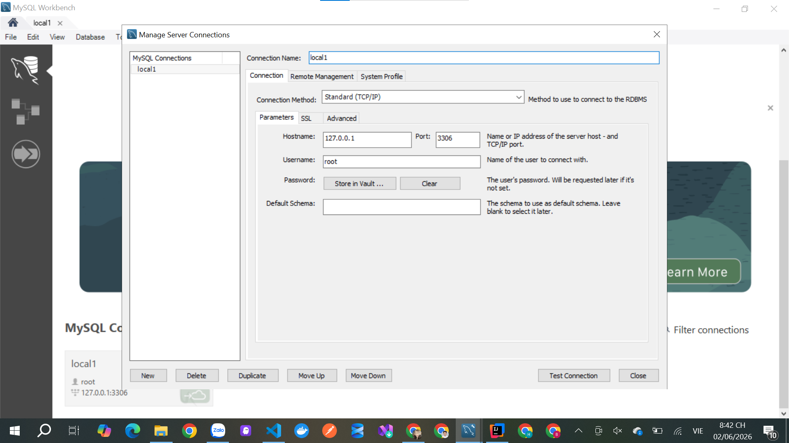

Mình đã đọc kỹ file. Bạn chọn Đề tài 6: Hệ thống Thương mại Điện tử Mini (Mini E-Commerce System). Theo đề bài, đây là hệ thống bán hàng trực tuyến có đầy đủ các nghiệp vụ: danh mục sản phẩm, tồn kho, giỏ hàng, đơn hàng, coupon và đánh giá sản phẩm.

1. Phân tích yêu cầu đề tài
1.1 Chức năng bắt buộc theo đề
Người dùng (Customer)
Đăng ký
Đăng nhập
Đăng xuất
Xem danh sách sản phẩm
Tìm kiếm sản phẩm
Lọc sản phẩm
Xem chi tiết sản phẩm
Thêm vào giỏ hàng
Cập nhật số lượng trong giỏ
Xóa khỏi giỏ hàng
Áp mã giảm giá
Thanh toán
Xem lịch sử đơn hàng
Xem chi tiết đơn hàng
Đánh giá sản phẩm
Quản trị viên (Admin)
CRUD sản phẩm
CRUD danh mục
CRUD coupon
Quản lý đơn hàng
Quản lý tồn kho
Dashboard thống kê
2. Các trang giao diện bắt buộc

Theo đề bài:

Khách hàng
Trang chủ
Trang danh sách sản phẩm
Trang chi tiết sản phẩm
Trang giỏ hàng
Trang thanh toán
Trang đơn hàng của tôi
Admin
Dashboard
Quản lý sản phẩm
Quản lý danh mục
Quản lý coupon
Quản lý đơn hàng
Quản lý tồn kho

3. Nên mở rộng để được điểm cao

Nếu chỉ làm đúng đề thì khá đơn giản.

Nên bổ sung:

Authentication
Đăng ký
Đăng nhập
JWT
Refresh Token
Forgot Password
User Profile
Thông tin cá nhân
Địa chỉ giao hàng
Dashboard Admin
Tổng sản phẩm
Tổng đơn hàng
Doanh thu
Đơn hàng mới nhất
Product
Upload nhiều ảnh
Sản phẩm nổi bật
Sản phẩm giảm giá
Order

Trạng thái:

PENDING
CONFIRMED
SHIPPING
DELIVERED
CANCELLED
4. Actor hệ thống
Customer
Mua hàng
Theo dõi đơn hàng
Đánh giá sản phẩm
Admin
Quản lý toàn bộ hệ thống
Guest
Xem sản phẩm
Tìm kiếm sản phẩm
5. Phân tích Database
Bảng User
users
Field	Type
id	bigint
username	varchar
email	varchar
password	varchar
role	varchar
Bảng Category
categories
Field
id
name
description
Bảng Product
products
Field
id
name
description
price
stock
image
category_id
Bảng Coupon
coupons
Field
id
code
discount
start_date
end_date
Bảng Cart
carts
Field
id
user_id
Bảng Cart Item
cart_items
Field
id
cart_id
product_id
quantity
Bảng Order
orders
Field
id
user_id
total_amount
status
created_at
Bảng Order Item
order_items
Field
id
order_id
product_id
quantity
price
Bảng Review
reviews
Field
id
user_id
product_id
rating
comment
6. ERD sơ bộ
User
 ├── Cart
 │     └── CartItem
 │            └── Product
 │
 ├── Order
 │     └── OrderItem
 │            └── Product
 │
 └── Review
        └── Product

Category
   └── Product

Coupon
   └── Order
7. API cần xây dựng
Auth
POST /api/auth/register
POST /api/auth/login
POST /api/auth/refresh
POST /api/auth/logout
Category
GET /api/categories
GET /api/categories/{id}

POST /api/categories
PUT /api/categories/{id}
DELETE /api/categories/{id}
Product
GET /api/products
GET /api/products/{id}

POST /api/products
PUT /api/products/{id}
DELETE /api/products/{id}
Cart
GET /api/cart

POST /api/cart/add
PUT /api/cart/update
DELETE /api/cart/remove
Coupon
POST /api/coupons/apply
Order
POST /api/orders

GET /api/orders
GET /api/orders/{id}

PUT /api/orders/{id}/status
Review
POST /api/reviews
GET /api/products/{id}/reviews
8. Các website tham khảo
Shopee

Shopee Việt Nam

Học:

Trang chủ
Danh sách sản phẩm
Chi tiết sản phẩm
Giỏ hàng
Lazada

Lazada Việt Nam

Học:

Bộ lọc sản phẩm
Thanh tìm kiếm
Quản lý đơn hàng
Tiki

Tiki

Học:

Review sản phẩm
Coupon
Thanh toán
Sendo

Sendo

Học:

Quản lý sản phẩm
Giao diện đơn giản
9. Kế hoạch làm việc (3 tuần)
Tuần 1
Phân tích
Use Case
Activity Diagram
ERD
Database
Backend
Tạo project Spring Boot
PostgreSQL
JWT
Security
User
Role
Tuần 2
Backend
Category
Product
Cart
Coupon
Order
Review
Swagger
Hoàn thiện API docs
Test API
Postman
Tuần 3
Frontend React
Authentication
Product
Cart
Checkout
Order
Admin
Dashboard
Product CRUD
Category CRUD
Coupon CRUD
Hoàn thiện
Responsive
README
Docker
10. Kiến trúc thư mục khuyến nghị
Backend
src/main/java/com/ecommerce

├── config
├── security
├── auth
├── user
├── category
├── product
├── cart
├── coupon
├── order
├── review
├── common
└── exception
Frontend
src

├── pages
├── components
├── layouts
├── services
├── hooks
├── store
├── routes
├── types
└── utils

Cơ sở dữ liệu dùng Mysql 